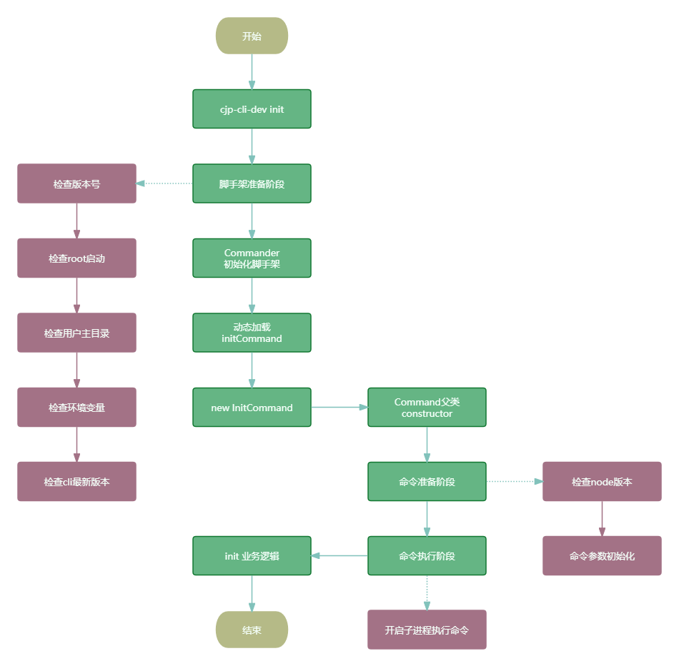
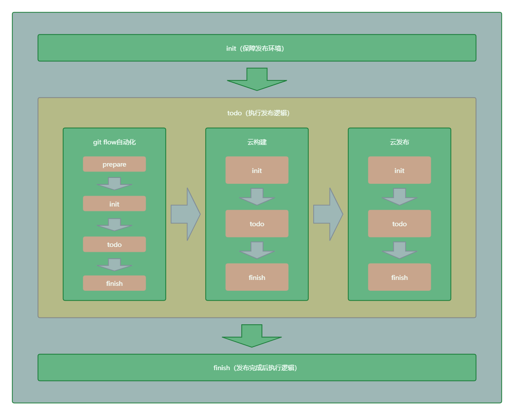
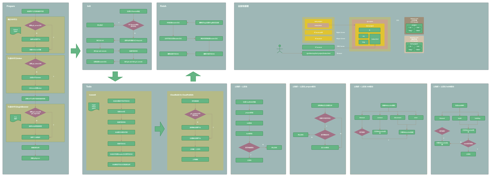
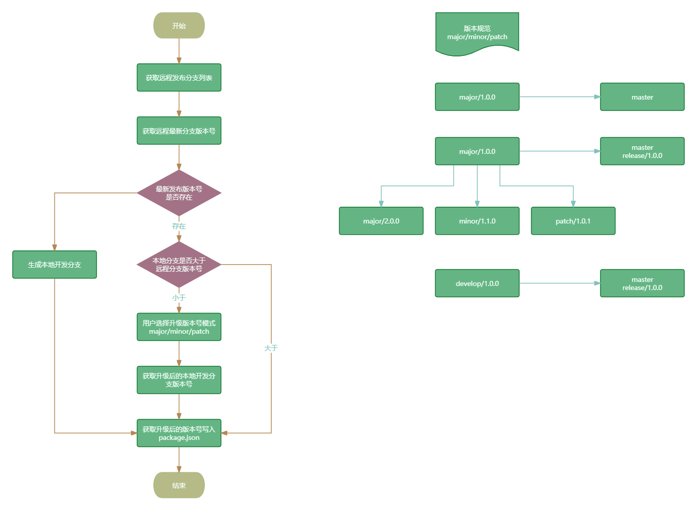

# 整体架构设计

## 脚手架架构设计图


高清源文件预览我放在这里了 [脚手架架构设计图](https://www.processon.com/view/link/5dba770fe4b09df5518a44b0) 。

## 脚手架模块拆分策略

脚手架使用 `lerna` 进行多模块管理，目前有以下模块。

```
cjp-cli-dev
├─ core                    # 核心层【cli准备、注册命令、解析命令参数、执行命令】
├─ commands                # 命令层【初始化、发布、回滚、复用】
├─ models                  # 功能模型层【git操作、云构建、npm模块、命令类】
├─ utils                   # 支撑层【工具方法、跨平台、npm信息、日志打印、http请求】
└─ lerna.json              # 采用lerna进行多包管理，目前用的6.6.2版本
```

模块拆分设计图如下：


高清源文件预览我放在这里了 [脚手架模块拆分设计图](https://www.processon.com/view/link/673e936833c4f837485ff5da)

## 脚手架执行命令流程设计

以 `init` 命令作为示例，其他命令执行流程一致。



高清源文件预览我放在这里了 [脚手架执行命令流程设计图](https://www.processon.com/view/link/674003c694ce030e32bc8b43)

## 脚手架发布流程设计



高清源文件预览我放在这里了 [脚手架发布流程设计图](https://www.processon.com/view/link/6740391e839bfb71123a0ab9)

## 脚手架Git Flow自动化流程设计



高清源文件预览我放在这里了 [脚手架Git Flow自动化流程设计图](https://www.processon.com/view/link/6743ecb5eb5248223d593bd9)

## 脚手架自动升级版本流程设计



高清源文件预览我放在这里了 [脚手架自动升级版本流程设计图](https://www.processon.com/view/link/67442609a1c0ad5bcd78e21e)
