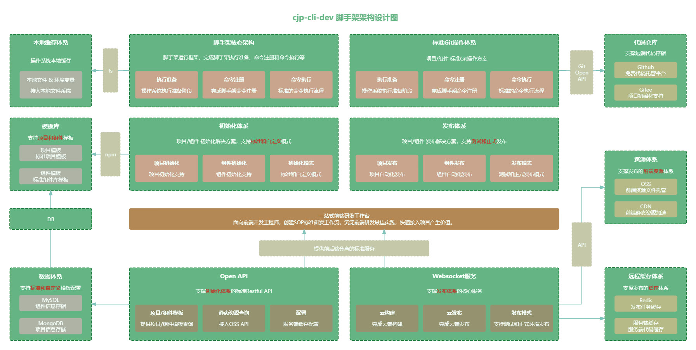
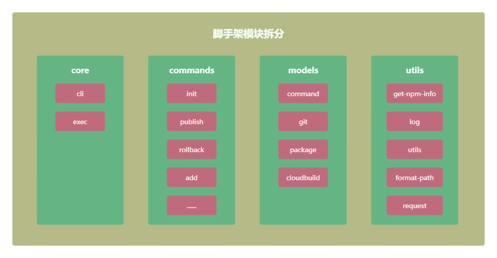

# 整体架构设计

## 脚手架架构设计图



高清源文件预览我放在这里了 [脚手架架构设计图](https://www.processon.com/view/link/5dba770fe4b09df5518a44b0?cid=5dba770fe4b002a645d3e5fb) 。

## 脚手架模块拆分策略

脚手架使用 `lerna` 进行多模块管理，目前有以下模块。

```
cjp-cli-dev
├─ core                    # 核心层【cli准备、注册命令、解析命令参数、执行命令】
├─ commands                # 命令层【初始化、发布、回滚、复用】
├─ models                  # 功能模型层【git操作、云构建、云发布、npm模块、命令规范】
├─ utils                   # 支撑层【工具方法、跨平台、npm信息、日志打印、http请求】
└─ lerna.json              # 采用lerna进行多包管理，目前用的6.6.2版本，高版本有问题
```

模块拆分设计图如下：



高清源文件预览我放在这里了 [脚手架模块拆分设计图](https://www.processon.com/view/link/673e936833c4f837485ff5da)
