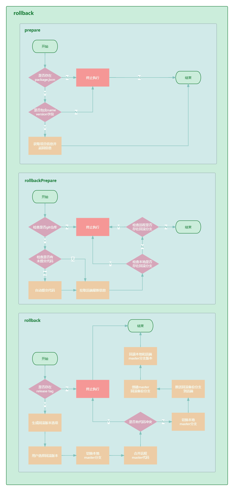
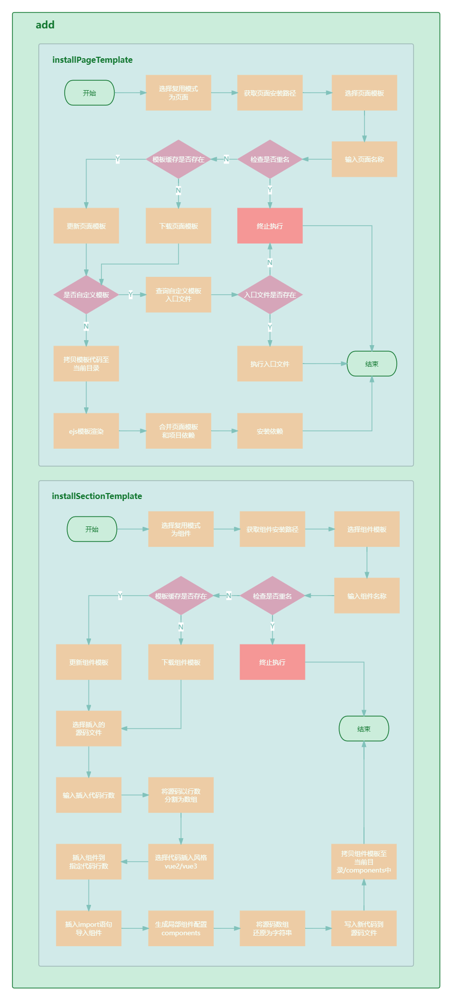

# commands模块

## init流程架构设计图

高清源文件预览我放在这里了 [init架构设计图](https://www.processon.com/view/link/673efceb69145c756603ff4b)

## publish流程架构设计图

高清源文件预览我放在这里了 [publish架构设计图](https://www.processon.com/view/link/674424e8a1c0ad5bcd78de60)

::: tip
`publish` 整体流程比较复杂，涉及到前后端完整交互，可结合 [脚手架发布流程设计](./README.md#脚手架发布流程设计) 、[脚手架Git Flow自动化流程设计](./README.md#脚手架git-flow自动化流程设计) 一起来理解。
:::

## rollback流程架构设计图

高清源文件预览我放在这里了 [rollback架构设计图](https://www.processon.com/view/link/6744318da1c0ad5bcd7905b8)

## add流程架构设计图

高清源文件预览我放在这里了 [add架构设计图](https://www.processon.com/view/link/674599fdf3d7a61e5dea1c48)
