# 配置

::: tip
脚手架将使用 `npm` 来安装模板，因此你需要将模板发布到 `npm` 或 `自建私有npm源` 上，修改配置后进行安装，支持指定安装源。

`本地 JSON 配置` 和 `MongoDB 配置` 只需选择一项就行，优先读取本地配置。

目前脚手架 `init` 、 `add` 命令支持 `本地 JSON 配置`。

如果你想体验 `publish` 命令的 `云构建`、`云发布` 功能，需要先安装和配置 `Redis`、`MySQL`。

查看 [如何安装和配置 Redis](#redis配置)

查看 [如何安装和配置 MySQL](#mysql配置)
:::

作为一款通用脚手架，你可以按团队要求定制自己的模板来快速复用。

模板如何创建？请查看 [模板创建](./template.md) 说明。

自建私有npm源推荐使用 [verdaccio](https://www.npmjs.com/package/verdaccio)，你可以搜索相关教程。

## 本地JSON配置模板

以Windows示例，本地JSON配置目录在 `C:/用户主目录/.cjp-cli-dev/data` 中，如：

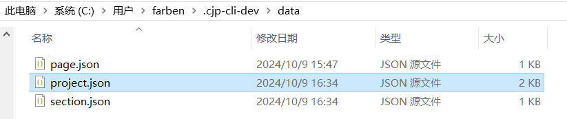

### 项目/组件库模板配置

下面是我创建好的测试配置，你可以使用它来进行测试，请在本地配置目录中创建 `project.json` ，并将以下代码粘贴到项目模板配置文件中。

```json
[
  {
    "name": "vue3-vite标准模板",
    "npmName": "cjp-cli-dev-template-vue3",
    "description": "",
    "version": "1.0.0",
    "type": "normal",
    "tag": [
      "project"
    ],
    "ignore": [
      "**/public/**"
    ],
    "installCommand": "npm install",
  },
  {
    "name": "vue3-webpack自定义模板",
    "npmName": "cjp-cli-dev-template-vue3-admin",
    "description": "",
    "version": "1.0.0",
    "type": "custom",
    "tag": [
      "project"
    ],
    "ignore": [
      "**/public/**"
    ]
  },
  {
    "name": "通用vue3组件库模板",
    "npmName": "cjp-cli-dev-template-vue3-component",
    "description": "",
    "version": "1.0.6",
    "type": "normal",
    "tag": [
      "component"
    ],
    "ignore": [
      "**/public/**",
      "**/**.png"
    ],
    "installCommand": "npm install --registry=https://registry.npmmirror.com",
    "startCommand": "npm run serve",
    "buildPath": "dist",
    "examplePath": "examples"
  },
  {
    "name": "vue3-vite自定义模板",
    "npmName": "cjp-cli-dev-template-vue3-custom",
    "description": "",
    "version": "1.0.0",
    "type": "custom",
    "tag": [
      "project"
    ],
    "ignore": [
      "**/public/**"
    ],
    "installCommand": "npm install",
    "startCommand": "npm run dev"
  },
  {
    "name": "vue3-webpack移动端标准模板",
    "npmName": "cjp-cli-dev-template-vue3-webpack-mobile",
    "description": "移动端项目，来源于水利门户粤政易端",
    "version": "1.0.0",
    "type": "normal",
    "tag": [
      "project"
    ],
    "ignore": [
      "**/public/**"
    ],
    "installCommand": "npm install",
    "startCommand": "npm run dev"
  }
]
```

### 页面模板配置

下面是我创建好的测试配置，你可以使用它来进行测试，请在本地配置目录中创建 `page.json` ，并将以下代码粘贴到项目模板配置文件中。

```json
[
  {
    "name": "vue3首页模板",
    "description": "用于演示标准ejs渲染的页面模板",
    "npmName": "cjp-cli-dev-template-vue3-template-page",
    "version": "latest",
    "targetPath": "src/views/home",
    "ignore": [
      "**/**.png"
    ],
    "type": "normal"
  },
  {
    "name": "vue3自定义页面模板",
    "npmName": "cjp-cli-dev-template-vue3-page-custom",
    "description": "用于演示自定义ejs渲染的页面模板，采用vue3+vite搭建",
    "version": "latest",
    "targetPath": "src/views",
    "ignore": [
      "**/**.png"
    ],
    "type": "custom"
  }
]
```

### 代码片段模板配置

下面是我创建好的测试配置，你可以使用它来进行测试，请在本地配置目录中创建 `section.json` ，并将以下代码粘贴到项目模板配置文件中。

```json
[
  {
    "name": "vue3代码片段模板1",
    "npmName": "cjp-cli-dev-template-vue3-section",
    "description": "",
    "version": "latest",
    "targetPath": "./"
  },
  {
    "name": "vue3代码片段模板2",
    "npmName": "cjp-cli-dev-template-vue3-section-template",
    "description": "",
    "version": "latest",
    "targetPath": "src/"
  }
]
```

### 运行依赖本地配置的脚手架命令

本地JSON配置完成后，你可以运行脚手架init命令、add命令了。

```bash
# 初始化项目
cjp-cli-dev init my-project
# 安装组件代码片段模板，如安装MyComponent组件
cjp-cli-dev add MyComponent
```

## MongoDB配置模板

> 没有必要需求使用本地JSON配置即可，毕竟配置服务端比较麻烦，也不是每个前端都想学习服务端，随意吧。

### 前置工作

你需要先安装MongoDB和UI界面管理工具（Windows推荐MongoDBCompass，MacOS随意）。

- [MongoDB 下载](https://www.mongodb.com/try/download/community)
- [MongoDBCompass 下载](https://www.mongodb.com/try/download/compass)
- [MongoDB 参考教程](https://www.runoob.com/mongodb/mongodb-tutorial.html)
- [MongoDBCompass 参考教程](https://developer.aliyun.com/article/1618937)

安装完成后需要启动 `MongoDB` 才能进行连接，以Windows为例，MacOS可搜索相关教程。

```bash
net start MongoDB
```

### 连接MongoDB数据库

打开MongoDBCompass进行连接，默认 `localhost:27017` ，点击保存并连接后创建数据库和数据表（如果你不知道怎么操作，请点击上面的MongoDBCompass 参考教程链接），如下图所示：

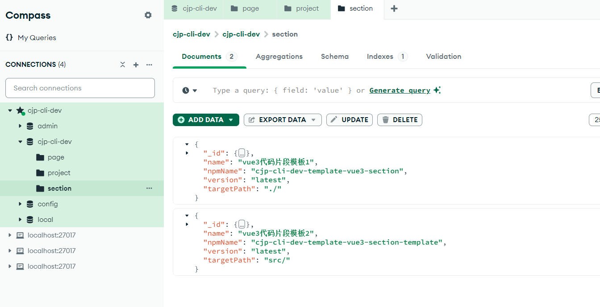

操作完成后我们拥有了以下内容，接着只需要插入相应的配置到数据表中即可，你可以按照下面的指引复制JSON插入数据。

- `cjp-cli-dev数据库`
- `project数据表`：参考前面文章内容 `本地JSON配置`  > [项目/组件库模板配置](#项目-组件库模板配置)
- `page数据表`：参考前面文章内容 `本地JSON配置`  > [页面模板配置](#页面模板配置)
- `section数据表`：参考前面文章内容 `本地JSON配置`  > [代码片段模板配置](#代码片段模板配置)

表数据插入完成后可以参考如何 [启动服务端](#启动服务端) 进行测试。

目前 `init`、`add` 命令支持通过服务端提供的接口连接 `MongoDB > cjp-cli-dev数据库` 来获取数据。

## 启动服务端

主要还是为了学习服务端知识，服务端采用和前端比较贴合的 `eggjs` 搭建，实现了 `云构建` 、`云发布` 等功能，也提供了连接和操作 `MongoDB` 、`Redis`、`MySQL`、`OSS` 等功能代码，可以作为你的参考。

::: tip
别问，问就是穷鬼买不起服务器和域名，需要拉服务端代码来启动。
:::

### 步骤

1. 配置 `host` 域名映射，好处是未来更换任何服务器都可以通过域名映射过去而不用修改源码，推荐安装 [SwitchHost](https://github.com/oldj/SwitchHosts/releases) 管理 `host` 配置。

```yaml
# 本地MongoDB和Redis都支持通过127.0.0.1连接
127.0.0.1 cjp.clidev.xyz
# MySQL连接配置，查看本节文章后面的mysql配置说明，ip需替换为你的WSL IPv4地址
172.21.48.1 cjpclidev.top
```

2. 克隆服务端仓库代码。

```bash
# 克隆仓库
git clone https://gitee.com/Mr_Mikey/cjp-cli-server.git
# 进入项目目录
cd cjp-cli-server
```

1. 修改OSS配置（已配置好可忽略当前步骤），你需要先去阿里云控制台创建 `OSS Bucket` ，并打开服务端代码，修改 `config/db.js` ，替换相关配置，查看 [OSS配置](#oss配置) 说明。

2. 本地安装并配置MySQL（已配置好可忽略当前步骤），你需要先安装它，查看 [MySQL配置](#mysql配置) 说明。

3. 运行服务端应用

```bash
# 安装依赖
npm install
# 启动项目
npm run dev
```

### 运行依赖服务端的脚手架命令

启动服务端成功后，你可以运行脚手架init命令、add命令、publish命令了。

```bash
# 初始化项目
cjp-cli-dev init my-project
# 安装页面模板，如安装home页面
cjp-cli-dev add home
```

::: tip
`publish` 命令也依赖服务端，但由于 `publish` 命令具有阿里OSS上传能力、MySQL增删改查数据能力，会单独放在 [核心命令 - publish](./core-command.md#发布---publish命令) 中具体说明。
:::

## 模板配置字段说明

### 项目/组件库模板字段说明

项目和组件库模板的配置大部分字段都是一样的，不同的字段会做说明

| 字段名称       | 描述                                                       | 数据类型       | 是否必填 | 默认值 |
| -------------- | ---------------------------------------------------------- | -------------- | -------- | ------ |
| name           | 项目模板中文名字                                           | String         | 是       | 无     |
| description    | 这个项目模板的描述                                         | String         | 否       | 无     |
| npmName        | 要安装的npm包名                                            | String         | 是       | 无     |
| version        | 要安装的npm包版本（填写版本号或latest）                    | String         | 是       | 无     |
| type           | 项目类型（支持normal、custom）                             | String         | 是       | 无     |
| tag            | 项目类型标记（支持project、component）                     | Array\<String> | 是       | 无     |
| ignore         | ejs忽略配置（某个目录或者文件不需要ejs渲染）               | Array\<String> | 否       | 无     |
| installCommand | 项目安装命令（脚手架命令会读取该参数决定是否自动安装依赖） | String         | 否       | 无     |
| startCommand   | 项目启动命令（脚手架命令会读取该参数决定是否自动启动项目） | String         | 否       | 无     |

::: tip
`type` 字段目前支持项目配置 `normal` 和 `custom` ，组件库暂时仅支持 `normal` 。

`normal` 代表标准项目模板，`custom` 代表自定义项目模板。

请查看 [如何创建项目模板](./template.md#如何创建项目模板)
:::

组件库模板比项目模板多了两个字段配置，如下：

| 字段名称    | 描述             | 数据类型 | 是否必填 | 默认值   |
| ----------- | ---------------- | -------- | -------- | -------- |
| buildPath   | 构建结果输出路径 | String   | 是       | dist     |
| examplePath | 组件预览页面路径 | String   | 是       | examples |

::: tip
`buildPath` 不需要怎么解释，就是组件库的build输出结果目录 。

`examplePath` 表示组件示例页面的路径，例如开发一个element-ui，则每个组件对应有一个预览页面可供查看。

请查看 [如何创建组件库模板](./template.md#如何创建组件库模板)
:::

### 页面模板字段说明

| 字段名称    | 描述                                                     | 数据类型       | 是否必填 | 默认值 |
| ----------- | -------------------------------------------------------- | -------------- | -------- | ------ |
| name        | 页面模板的中文名字                                       | String         | 是       | 无     |
| description | 这个页面模板的描述                                       | String         | 否       | 无     |
| npmName     | 要安装的npm包名                                          | String         | 是       | 无     |
| version     | 要安装的npm包版本（填写版本号或latest）                  | String         | 是       | 无     |
| targetPath  | 页面模板的路径（当前模板中有多个页面时指定要安装哪一个） | String         | 是       | 无     |
| type        | 页面模板类型（支持normal、custom）                       | String         | 是       | 无     |
| ignore      | ejs忽略配置（某个目录或者文件不需要ejs渲染）             | Array\<String> | 否       | 无     |

::: tip
`targetPath` 的作用是指定要安装哪一个页面模板，比如当前提供的模板库中有n个页面模板，我只需要安装 `src/views/home`，则指定该字段即可。
:::

### 代码片段模板字段说明

| 字段名称    | 描述                                    | 数据类型 | 是否必填 | 默认值 |
| ----------- | --------------------------------------- | -------- | -------- | ------ |
| name        | 代码片段模板的中文名字                  | String   | 是       | 无     |
| description | 这个代码片段模板的描述                  | String   | 否       | 无     |
| npmName     | 要安装的npm包名                         | String   | 是       | 无     |
| version     | 要安装的npm包版本（填写版本号或latest） | String   | 是       | 无     |
| targetPath  | 代码片段模板的路径                      | String   | 是       | 无     |

## 全局环境变量配置

脚手架支持全局环境变量配置，默认情况下你不需要管，如果有需求，你可以在磁盘用户主目录下配置以下属性，后续有新增的配置也是在这里看。

| 名称                             | 说明                                       |
| -------------------------------- | ------------------------------------------ |
| process.env.CLI_HOME             | 用户主目录（读取用户主目录下的.env文件）   |
| process.env.CJP_CLI_DEV_BASE_URL | 接口请求前缀（读取用户主目录下的.env文件） |

Windows系统截图：

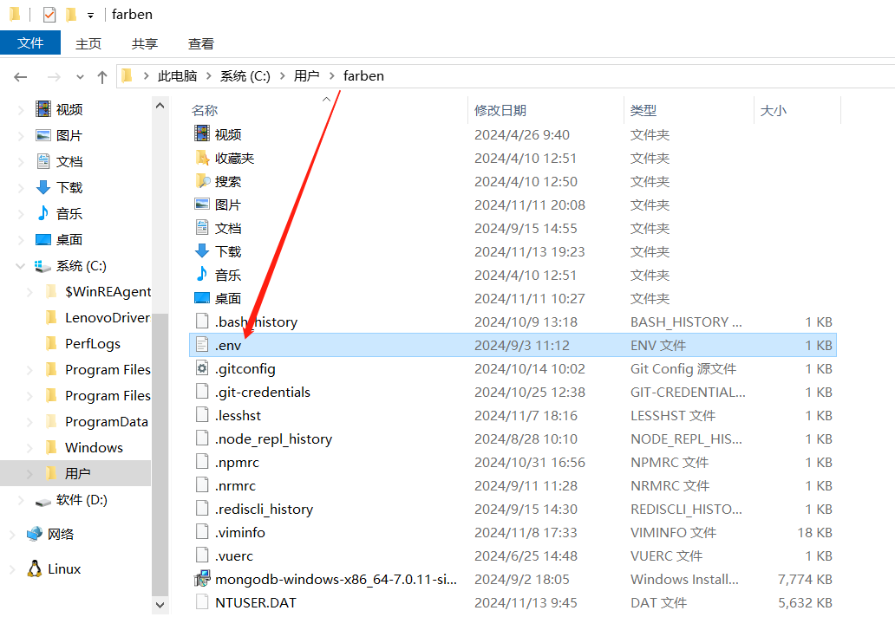

## Redis配置

`Redis` 在当前脚手架中用于 `publish` 命令中管理云构建任务。

> 没有必要需求调用 `publish` 命令时指定 `--noCloudBuild` 参数跳过云构建，毕竟又要安装又要启动服务端连接很麻烦，也不是每个前端都想学习服务端，随意吧。

### 前置工作

你需要先安装Redis。

- [Redis 下载](https://www.runoob.com/redis/redis-install.html)
- [Redis 参考教程](https://www.runoob.com/redis/redis-tutorial.html)

### 连接Redis

脚手架服务端应用已配置好连接本地 `Redis` 的相关代码，安装完成后你只需要 [启动服务端](#启动服务端) 即可连接，本地 `Redis` 默认连接 `127.0.0.1:6379` 。如果你有购买如 `阿里云Redis` 服务，可以修改服务端代码，路径为 `源码目录/config/config.default.js`，参考下图：

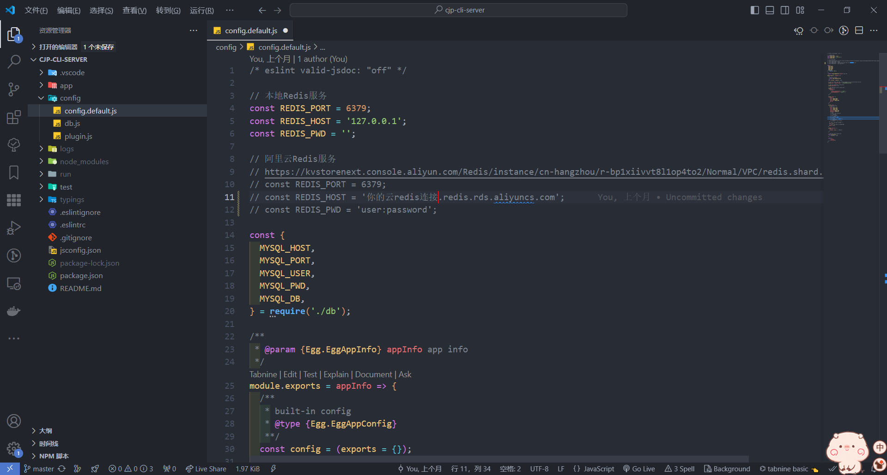

## MySQL配置

`MySQL` 在当前脚手架中用于 `publish` 命令中管理组件库发布信息和版本信息。

> 没有必要需求调用 `publish` 命令时指定 `--componentNoDb` 参数跳过发布信息写入 `MySQL` ，毕竟又要安装又要启动服务端连接很麻烦，也不是每个前端都想学习服务端，随意吧。

### 前置工作

你需要先安装 `MySQL` ，推荐使用 `docker` 进行安装和启动，否则安装起来特别麻烦。

- [docker 官网下载](https://www.docker.com/)
- [docker windows下载](https://www.alipan.com/s/EwfKPMc83gt)

docker官方镜像源非常不稳定，安装完成后你需要启动docker应用，并修改为国内镜像。例如：

- 阿里云加速 `https://d2bgx7ku.mirror.aliyuncs.com` （这是我生成的，你也可以自己去生成，查看下面链接）
- 网易云加速 `https://hub-mirror.c.163.com`
- 百度云加速 `https://mirror.baidubce.com`

[生成自己的阿里云镜像加速地址 -> 点击管理控制台 -> 登录账号(淘宝账号) -> 左侧镜像工具 -> 镜像加速器 -> 复制加速器地址](https://cr.console.aliyun.com/cn-hangzhou/instances/mirrors)

可以拷贝我的配置粘贴到下图对应位置，保存重启docker即可。

```json
{
  "builder": {
    "gc": {
      "defaultKeepStorage": "20GB",
      "enabled": true
    }
  },
  "experimental": true,
  "registry-mirrors": [
    "https://registry.docker-cn.com",
    "https://registry.cn-hangzhou.aliyuncs.com",
    "http://hub-mirror.c.163.com",
    "https://mirror.baidubce.com",
    "https://d2bgx7ku.mirror.aliyuncs.com"
  ]
}
```

修改docker镜像源截图

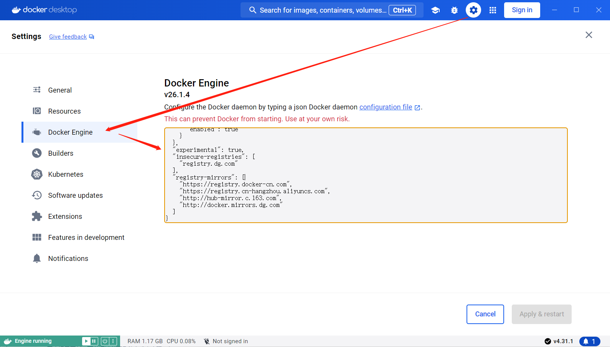

### 使用docker安装并启动MySQL

你需要先创建一个文件夹如 `mysql`，并在文件夹中创建 `conf`、`db`、`log` 三个目录，用来挂载MySQL的运行配置和日志文件，如下图：

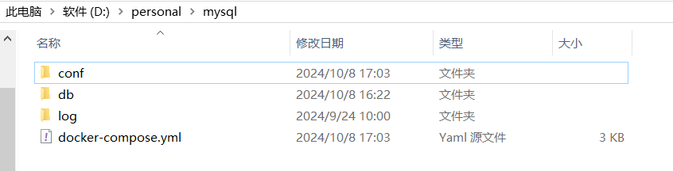

这里有一份 `docker-compose` 配置，代码如下，你需要在 `mysql` 目录中创建 `docker-compose.yml` 文件。

> PS：感谢我强哥教我怎么使用docker安装和连接 `MySQL` 。斯密码喽☺

```yaml
services:
 mysql:
   image: mysql:5.7
   container_name: mysql
   command: mysqld --character-set-server=utf8mb4 --collation-server=utf8mb4_unicode_ci --default-time_zone='+8:00' --lower_case_table_names=1
   restart: always
   environment:
     MYSQL_ROOT_PASSWORD: "Abc@123#pwd!" #设置root帐号密码
     TZ: "Asia/Shanghai"
   ports:
     - 3306:3306
   volumes:
     - ./db:/var/lib/mysql #数据文件挂载
     - ./conf:/etc/mysql/conf.d #配置文件挂载
     - ./log:/var/log/mysql #日志文件挂载
```

运行终端，执行 `docker-compose` 拉取 mysql 镜像并启动

```bash
# 进入mysql文件夹
cd mysql
# 启动docker-compose
docker-compose up
```

启动成功截图

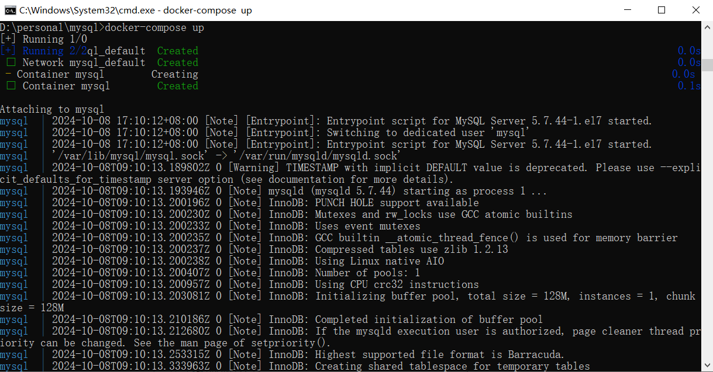

### 连接MySQL并创建数据库和数据表

::: tip
**注意：一定要使用本机 `WSL` 的 `IPv4` 地址才能正常连接 `MySQL` 。**

你可以打开终端运行 `ipconfig` 命令来查看 `WSL` 的 `IPv4` 地址，如下图
:::

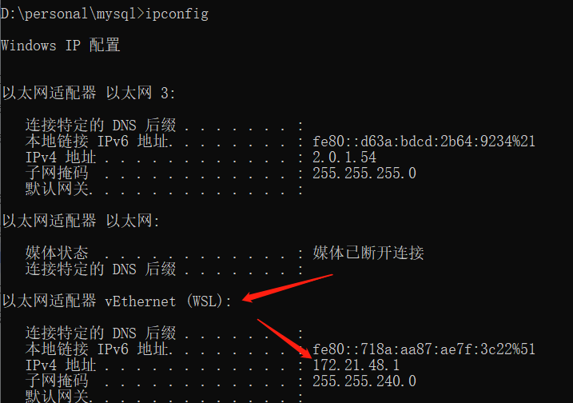

#### 客户端连接MySQL

需要先安装连接软件，我使用 Windows 的 `DBeaver` 软件进行连接示例，你想用其它软件也可以，MacOS 请随意。

这里有一份 Windows 版本的 [DBeaver](https://www.alipan.com/s/EwfKPMc83gt) 下载链接。

安装完成后打开 `DBeaver` 创建新的连接，你可以通过 `ipconfig` 命令来查看 `WSL` 的 `IPv4` 地址，默认端口为 `3306` ，用户名为 `root` ，密码是你在 `docker-compose.yml` 文件中的 `MYSQL_ROOT_PASSWORD` 属性值，你可以自行修改，但修改后你需要重新启动 `docker-compose` 运行 `MySQL` 并再次连接。

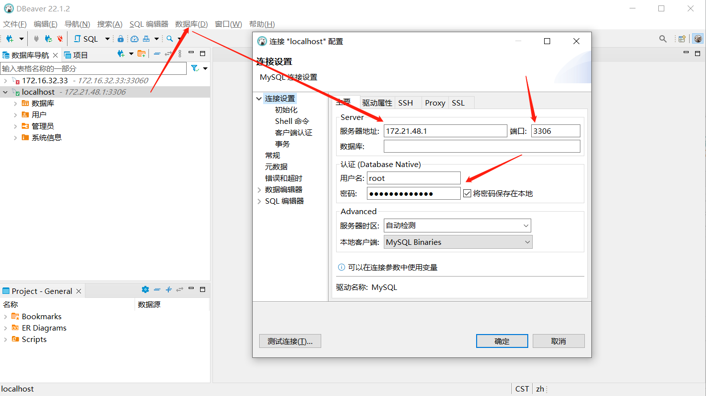

::: tip
如果你想在电脑上查看数据库的情况，比如测试 `publish` 命令发布组件信息写入 `MySQL` 是否成功，使用UI界面方便很多。

需要先创建数据库和数据表以及表字段后，脚手架服务端才能连接并进行操作，后面会演示如何通过 `DBeaver` 创建数据库和数据表。

当然如果你是个大佬，知道怎么用SQL语句来建库建表可以忽略这一步。但我觉得你不会，否则你也不至于要看这个菜鸡作者写的文档，还是老老实实接着看吧。
:::

#### 修改host配置

脚手架服务端应用配置了通过 `cjpclidev.top` 域名来连接 `MySQL`，你需要将域名映射到 `WSL` 的 `IPv4` 地址。

```yaml
# 请将172.21.48.1替换成你的`WSL` 的 `IPv4` 地址
172.21.48.1 cjpclidev.top
```

不知道怎么查看？[如何查看本机 WSL IPv4 地址](#连接mysql并创建数据库和数据表)

#### 创建数据库

在 `DBeaver` 中新建数据库，库名 `cjp-cli-dev`，字符集选择 `utf8mb4`，排序规则选择 `utf8mb4_unicode_ci`，如下图，点击确认创建即可。

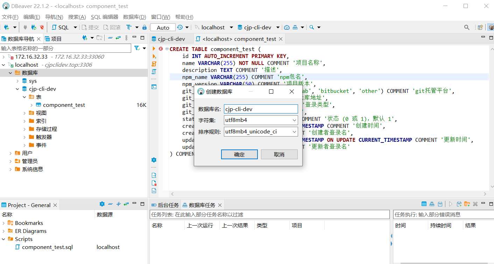

#### 创建数据表

这里我们需要创建两张表，脚手架服务端应用会操作这两张数据表来管理组件发布信息和版本记录信息。

| 表名           | 备注                     |
| -------------- | ------------------------ |
| component_test | 管理组件发布信息         |
| version_test   | 管理组件版本发布记录信息 |

在 `DBeaver` 中操作创建，右键点击 `cjp-cli-dev` 数据库，选择 `SQL编辑器`。

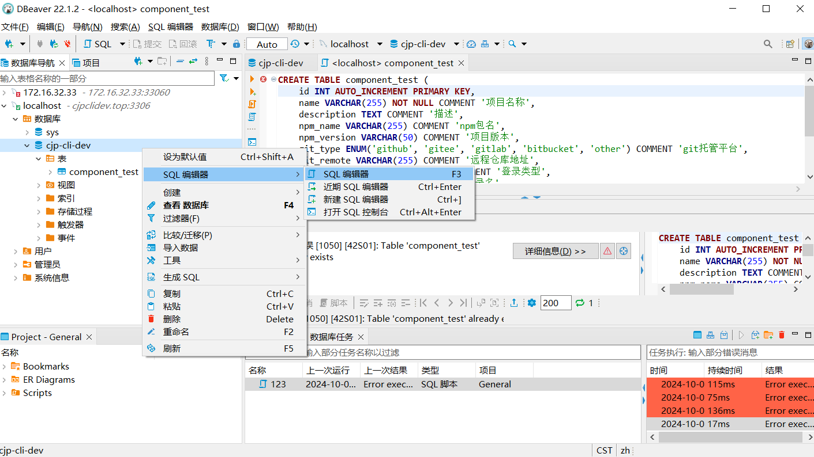

编写SQL建表语句，请将下面的`component_test` SQL建表语句代码粘贴到 `DBeaver` 新开窗口中。

::: tip
注意这里要选 `New script`，否则会创建失败。
:::

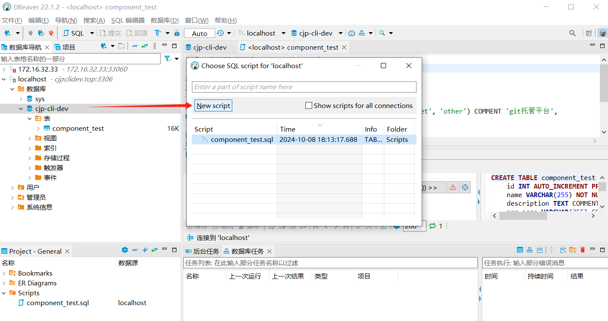

`component_test` SQL建表语句代码如下：

```sql
CREATE TABLE component_test (
    id INT AUTO_INCREMENT PRIMARY KEY,
    name VARCHAR(255) NOT NULL COMMENT '项目名称',
    description TEXT COMMENT '描述',
    npm_name VARCHAR(255) COMMENT 'npm包名',
    npm_version VARCHAR(50) COMMENT '项目版本',
    git_type ENUM('github', 'gitee', 'gitlab', 'bitbucket', 'other') COMMENT 'git托管平台',
    git_remote VARCHAR(255) COMMENT '远程仓库地址',
    git_owner ENUM('org', 'user') COMMENT '登录类型',
    git_login VARCHAR(255) COMMENT '登录名',
    status TINYINT(1) NOT NULL DEFAULT 1 COMMENT '状态 (0 或 1)，默认 1',
    create_dt BIGINT NOT NULL COMMENT '创建时间（时间戳）',
    create_by VARCHAR(255) NOT NULL COMMENT '创建者登录名',
    update_dt BIGINT NOT NULL COMMENT '更新时间（时间戳）',
    update_by VARCHAR(255) NOT NULL COMMENT '更新者登录名'
) COMMENT='组件信息表';
```

点击执行按钮，执行SQL建表语句，创建 `component_test` 表，如下图

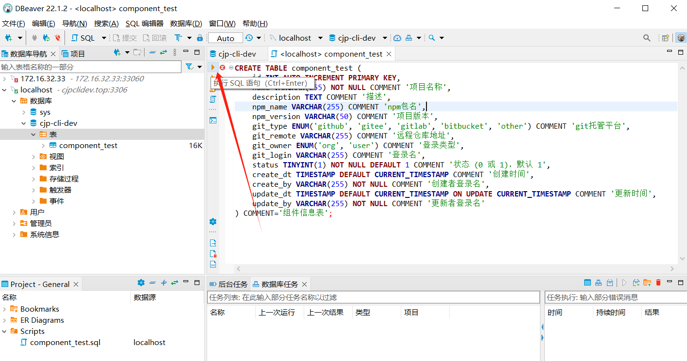

执行脚本如果没有报错，鼠标右键【表】，点刷新后可以看到创建的 `component_test` 表，如下图

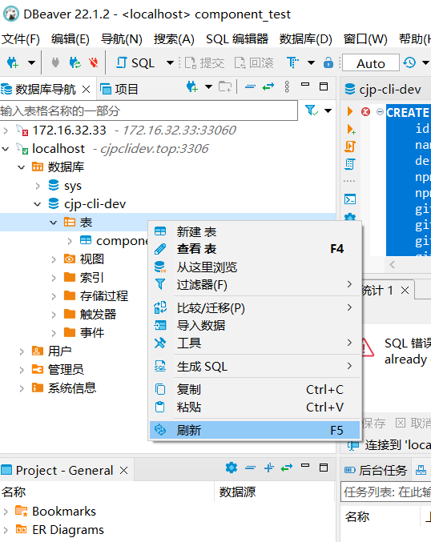

::: tip
请按照前面创建 `component_test` 的步骤创建 `version_test` 表，创建完成后你可以 [启动服务端](#启动服务端) 来测试 `publish` 命令 `云构建`、`云发布` 功能。
:::

`version_test` SQL建表语句代码如下：

```sql
CREATE TABLE version_test (
    id INT AUTO_INCREMENT PRIMARY KEY,
    component_id INT NOT NULL COMMENT '组件id',  -- 修改为INT类型，与component_test表的id字段匹配
    version VARCHAR(255) NOT NULL COMMENT '组件版本',
    build_path VARCHAR(255) NOT NULL COMMENT '打包文件路径',
    example_path VARCHAR(255) DEFAULT NULL COMMENT '演示路径',
    example_list TEXT DEFAULT NULL COMMENT '演示文件列表',
    example_real_path VARCHAR(255) DEFAULT NULL COMMENT '演示文件真实路径',
    status TINYINT(1) NOT NULL DEFAULT 1 COMMENT '状态，0 或 1，默认 1',
    create_dt BIGINT NOT NULL COMMENT '创建时间（时间戳）',
    create_by VARCHAR(255) NOT NULL COMMENT '创建者登录名',
    update_dt BIGINT NOT NULL COMMENT '更新时间（时间戳）',
    update_by VARCHAR(255) NOT NULL COMMENT '更新者登录名',
    FOREIGN KEY (component_id) REFERENCES component_test(id) -- 添加外键约束
) COMMENT='组件版本信息表' ENGINE=InnoDB DEFAULT CHARSET=utf8mb4;
```

## OSS配置

`OSS` 在当前脚手架中用于 `publish` 命令上传项目构建结果，后续可通过域名映射来直接访问页面（暂未实现）。

### 前置工作

你需要先创建好相关 `OSS Bucket` 和 `Access Key`。

- [阿里云OSS管理控制台](https://oss.console.aliyun.com/overview)
- [阿里云AccessKey](https://ram.console.aliyun.com/profile/access-keys)

> AccessKey ID 和 AccessKey Secret 是你访问阿里云 API 的密钥，具有该账户的完全权限，是脚手架 `publish` 命令连接 `OSS Bucket` 创建文件夹并上传文件的关键，请妥善保管。

打开 [阿里云OSS管理控制台](https://oss.console.aliyun.com/overview) ，在左侧选择 `Bucket列表` ，点击 `创建 Bucket` ，输入 `Bucket 名称` ，选择离你最近的 `地域` ，其它选项都默认即可，点击 `完成创建` 。

::: tip
脚手架服务端代码中演示了 `发布生产` 和 `发布测试` 环节，对应 `cjp-cli` 和 `cjp-cli-dev` 两个 `Bucket` ，你也需要创建两个 `Bucket` 来区分生产和测试。
:::

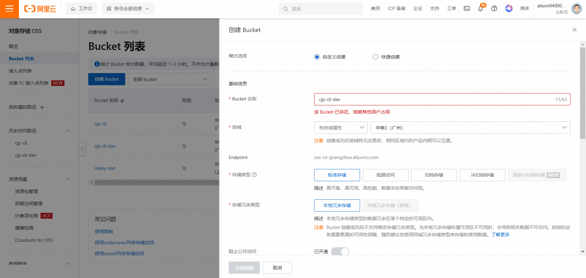

打开 [阿里云AccessKey](https://ram.console.aliyun.com/profile/access-keys) ，点击创建AccessKey。

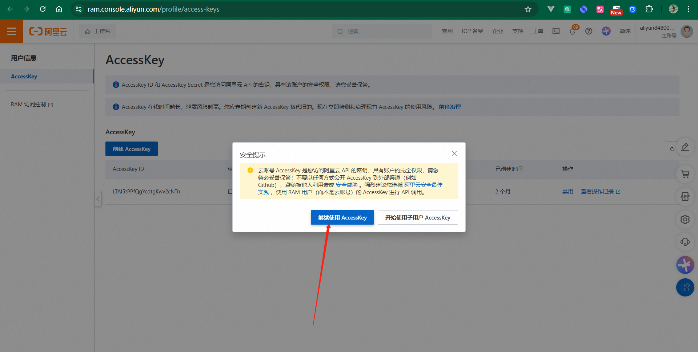

2023年7月3日起阿里云主账号创建AccessKey之后访问控制不再提供查询Secret的功能，[查看公告](https://www.aliyun.com/notice/detail?spm=5176.29412652.J_dNfRwvqdiCuiLSU0gOuJF.2.740b19d5c3KZm6&notice-id=114599) 。也就是说它只会在你创建的时候显示一次，你需要保管好，之后将不再能查看，忘了只能重新创建。

### 修改OSS服务端配置

你需要将刚才创建的 `AccessKey` 复制下来，并在 `用户主目录/.cjp-cli-dev/` 目录中创建一个 `oss_access_secret_key` 文件，将复制的Key粘贴保存，服务端会读取该文件中的Key。

然后打开服务端代码，找到 `config/db.js` 中的OSS配置信息，修改以下配置，如图所示：

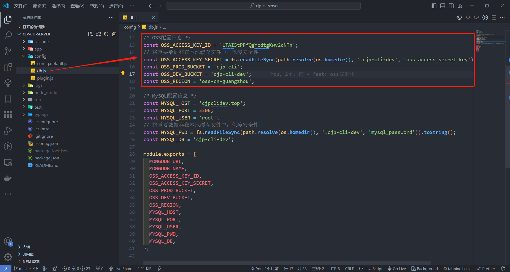

- `OSS_ACCESS_KEY_ID` ：也就是你刚才创建 `AccessKey` 的界面显示的 `AccessKey ID`
- `OSS_PROD_BUCKET` ：修改为你刚才创建的生产 `Bucket` 名称
- `OSS_DEV_BUCKET` ：修改为你刚才创建的测试 `Bucket` 名称
- `OSS_REGION` ：你创建 `Bucket` 时选择的地域，一般格式为 `oss-cn-城市完整拼音`

::: tip
修改配置完成后你可以 [启动服务端](#启动服务端) 来测试 `publish` 命令 `云发布上传OSS` 功能。
:::
