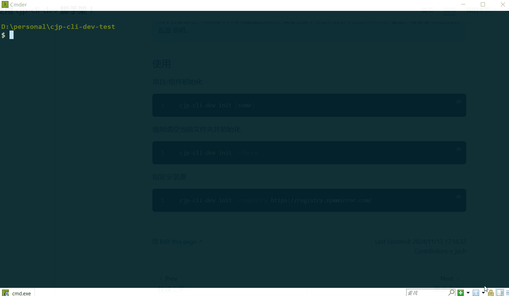
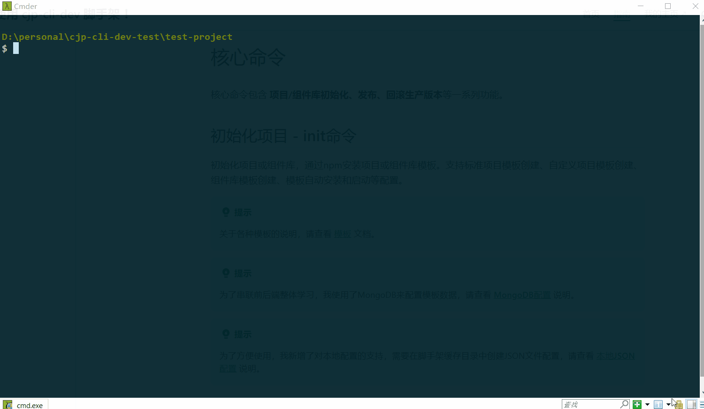

# 核心命令

核心命令包含 **项目/组件库初始化、发布、回滚生产版本**等一系列功能。

使用前你需要先安装脚手架，如果你还没有安装，请查看 [快速上手](./getting-started.md) 。

关于核心命令的架构，后面会单独写文档进行说明。

## 初始化 - init命令

初始化项目或组件库，通过npm安装项目或组件库模板。支持标准项目模板创建、自定义项目模板创建、组件库模板创建、模板自动安装和启动等配置。

::: tip
关于各种模板的说明以及如何创建，请查看 [模板](./template.md) 文档。
:::

::: tip
为了串联前后端整体学习，我使用了 `MongoDB` 来配置模板数据，请查看 [MongoDB配置模板](./configuration.md#mongodb配置模板) 说明。
:::

::: tip
为了方便使用，我新增了对本地配置的支持，需要在脚手架缓存目录中创建JSON文件配置，请查看 [本地JSON配置模板](./configuration.md#项目-组件库模板配置) 说明。
:::

::: tip
如果你还不熟悉脚手架的使用范式，请查看 [快速上手](./getting-started.md#命令使用范式) 说明。

如果你想查看当前命令支持什么参数，请查看 [命令使用帮助](./getting-started.md#命令使用帮助)。
:::

### 使用

你可以按照以下方式使用

```bash
cjp-cli-dev init [projectName]
# 或者你不输入项目名称也可以，直接执行init，执行过程中会提示你输入项目名称，如：
cjp-cli-dev init
```

`init` 命令支持以下参数：

- **--registry**：指定 `npm` 下载源
- **--force**：强制初始化，清空当前目录并安装新的模板

### 示例

你现在想创建一个项目 `test-project` ，需要先创建一个 `test-project` 文件夹 ，进入该文件夹，执行以下命令，选择你想要安装的项目模板，当然，这需要你先配置好模板数据，查看 [模板如何配置](./configuration.md)。

```bash
cjp-cli-dev init test-project
```

由于你太菜了，一不小心把代码搞坏了，于是你希望重新安装模板再来过，暗暗发誓这次一定要成功，但你又不想手动删除项目里的文件。

```bash
cjp-cli-dev init test-project --force
```

此时你发现安装速度非常慢，一气之下想换个速度快的下载源。

```bash
cjp-cli-dev init test-project --force --registry https://registry.npmmirror.com/
```

### 动画演示

做个动画给你看看，只要你闭上眼就很难发现作者只演示了一小部分。



## 发布 - publish命令

发布项目或组件库，包括**测试发布和正式发布** 、支持自动在 `github` 、`gitee` 创建远程仓库和提交代码、`Git Flow` 自动化处理。 支持**项目云构建、云发布**，采用 `Redis` 管理云构建任务数据，发布完成自动清除 `Redis` 缓存，静态资源自动上传 `阿里OSS`、自动同步代码和创建版本tag，支持 `MySQL` 管理发布组件信息。

::: tip
为了串联前后端整体学习，我使用了 `Redis`、`MySQL` 以及 `OSS静态资源托管`，这些都需要依赖服务端应用，请查看 [启动服务端](./configuration.md#启动服务端) 说明。
:::

::: tip
为了方便使用，我新增了 `--noCloudBuild` 参数，针对项目类型，指定该参数时会关闭云构建和云发布，你可以手动上传构建结果到OSS或自己的静态资源服务器。

针对组件库类型，也新增了 `--componentNoDb` 参数，指定该参数可以关闭将组件信息写入 `MySQL` 操作。

如果你还不怎么了解服务端知识，在执行发布命令时针对不同类型项目添加以上参数，能够让你快速体验脚手架功能。
:::

::: tip
由于目前我没有域名和服务器，`OSS` 上无法配置域名解析直接进行页面访问，你可以按照自己的需求修改服务端代码以适配自己的需求，当然，这需要你对服务端有一定了解。

我也会补充一些相关教程，敬请期待。
:::

::: tip
如果你还不熟悉脚手架的使用范式，请查看 [快速上手](./getting-started.md#命令使用范式) 说明。

如果你想查看当前命令支持什么参数，请查看 [命令使用帮助](./getting-started.md#命令使用帮助)。
:::

### 使用

你可以按照以下方式使用

```bash
cjp-cli-dev publish
```

`publish` 命令支持以下参数：

- **--refreshGitServer**：更新Git托管平台
- **--refreshGitToken**：更新Git托管平台token
- **--refreshGitOwner**：更新Git仓库登录类型
- **--production**：是否正式发布
- **--buildCmd**：指定自定义构建命令
- **--registry**：指定 `npm` 下载源
- **--noCloudBuild**：发布项目不开启云构建
- **--componentNoDb**：发布组件库信息不写入数据库
- **--sshUser**：指定模板服务器用户名
- **--sshIp**：指定模板服务器IP或域名
- **--sshPath**：指定模板服务器上传路径

### 示例

刚才你通过 `init` 命令创建了 `test-project` 项目，你很懒，不想手动打开浏览器输入全球最大的同性交友网站 `Github` 地址，再苦逼的创建仓库然后给 `test-project` 设置远程地址再推送代码，这时候你还发现登录状态过期了，还要你输入账密加验证进行登录，于是火大的你给自己创建了一个过期时间老久老久的 `access_token`，以后再也不想体验手动这么麻烦的事情了，你突然想到了好像有个功能不完善的垃圾命令刚好能满足你当下想偷懒的想法，只需要输入一行命令，什么智能提醒、智能检查、自动提交、版本管理通通一网打尽，简直不要太爽。

```bash
cjp-cli-dev publish
```

你有点花心，不满足于创建个人仓库自己一个人单排，还想创建组织拉点人深夜一起去小房间讨论技术。于是你在全球最大的同性交友网站上创建了一个交友组织，并切换身份发布了一个群聊。

```bash
cjp-cli-dev publish --refreshGitOwner
```

某天你心血来潮，想去祸害一下国区码云 `Gitee`，于是你又去码云给自己创建了一个过期时间老久老久的 `access_token`，但却不知道要怎么切换托管平台，心里很不爽，没想到的是作者预判了你的预判。

```bash
cjp-cli-dev publish --refreshGitServer --refreshGitToken
```

由于你以前没有同性交友的经验，经过长期在小群里面锻炼，你现在胆子大了，想把交友信息发布到正式交友群里。

```bash
cjp-cli-dev publish --production
```

在你发布交友信息时你发现提供模板那傻逼给的打包命令不对，于是你还得自己动手丰衣足食。

```bash
cjp-cli-dev publish --buildCmd "npm run build:prod"
```

在你好不容易解决了所有问题后，发送交友信息终于成功了，但你发现发送信息很慢，这你忍不了，于是给它打了点鸡血让它加速发送。

```bash
cjp-cli-dev publish --registry https://registry.npmmirror.com/
```

你发布了一条交友信息，并把标题伪装成【项目发布】，结果发现作者那傻逼搞了什么云构建啥啥的导致发布失败了，你也搞不懂但你知道搞起来贼麻烦，于是你花了点小钱强迫作者开了后门。

```bash
cjp-cli-dev publish --noCloudBuild
```

你上次交友非常成功，感叹有钱真好的同时又发布了一条交友信息，并把标题伪装成【组件发布】，又发现作者那傻逼搞了什么 `MySQL` 管理组件发布信息，导致发布再次失败了，于是你再次感叹了有钱真好。

```bash
cjp-cli-dev publish --componentNoDb
```

由于最近频繁交友导致开销有点大，手头紧，这次你不想和作者玩了，你想把发布的交友信息备份到自己的电脑里，下次交新朋友可以直接拿来撒网。

```bash
cjp-cli-dev publish --sshUser root --sshIp 1xx.xx.xx.xx:8888 --sshPath /data/apps
```

### 动画演示

做个动画给你看看，只要你闭上眼就很难发现作者只演示了一小部分。



### 关于

讲点正经的，`publish` 命令目前还在开发阶段，这里面涉及到很多复杂的实现，每个公司的规范和流程都有所区别，该命令还有很多不完善的地方，但这是一个很好的实现思路，按照这个思路你可以复刻出属于自己公司的标准自动化发布工具。
