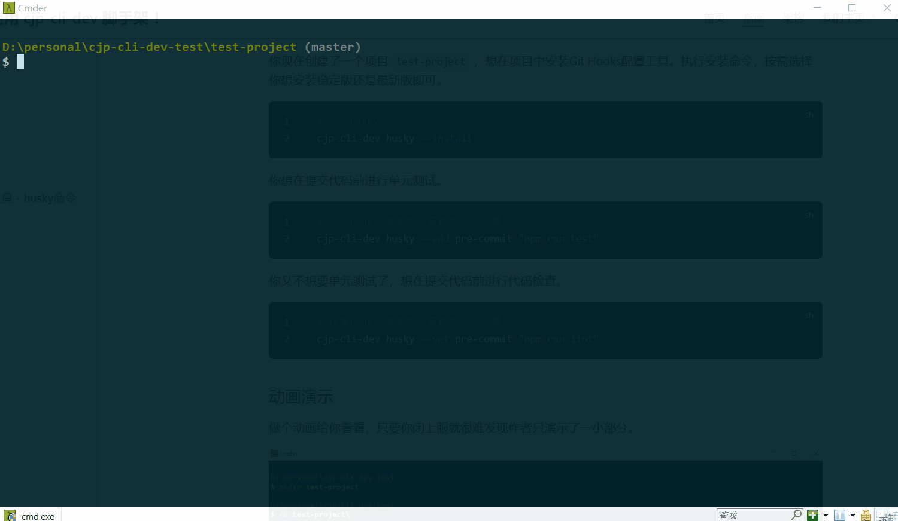
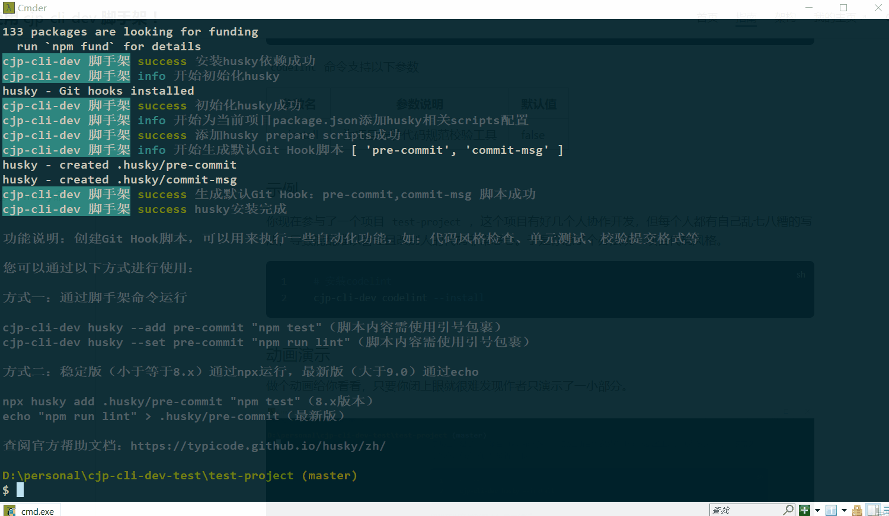
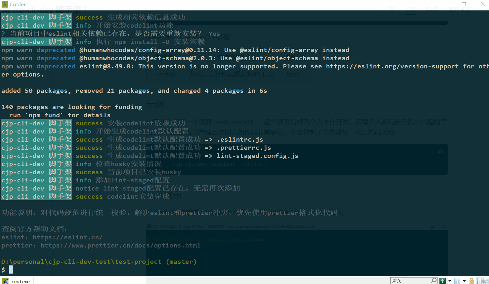
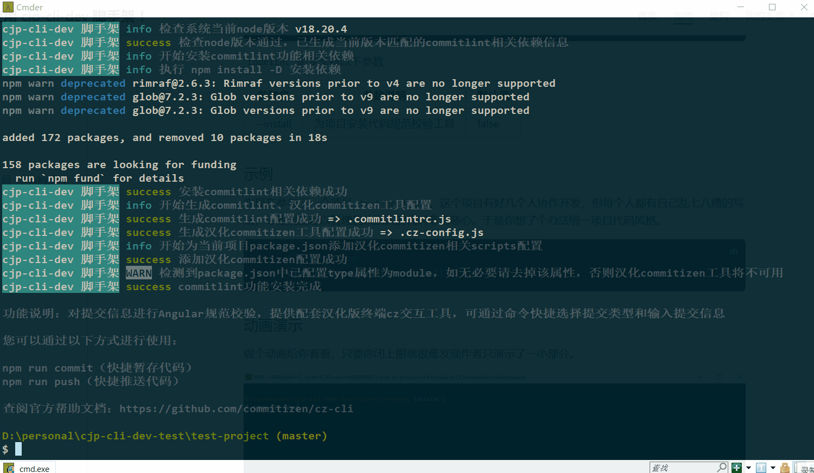
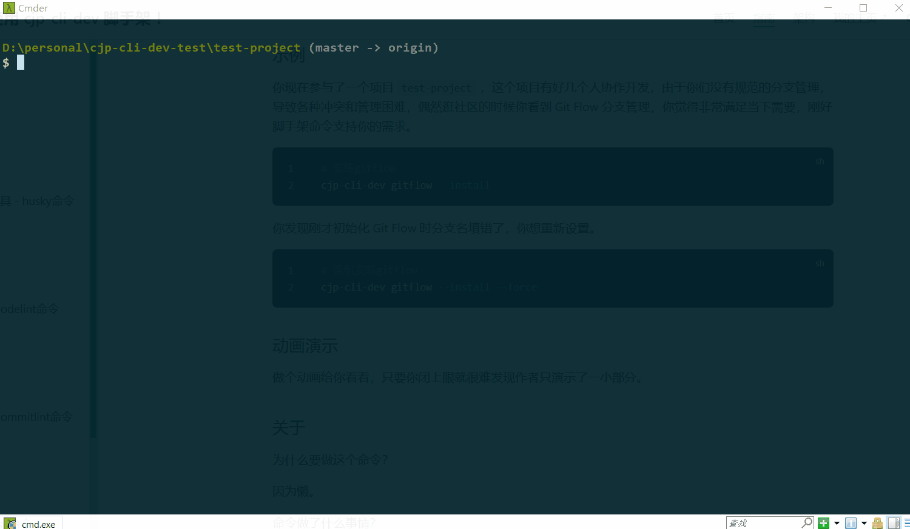

# 其它命令

其它命令包含安装 **husky工具、统一项目代码规范、统一项目提交信息规范、升级项目版本、创建Git Flow分支模型、启动本地页面预览服务、创建markdown简历** 等一系列大杂烩功能。

未来会增加更多能用命令来解决的我能想到的复杂操作，你有想法或者建议可以邮箱联系我。

<details>
  <summary>点击查看作者联系方式</summary>
  <!-- 这里是隐藏的文本内容 -->
  <strong>1303232158@qq.com</strong>
</details>

使用前你需要先安装脚手架，如果你还没有安装，请查看 [快速上手](./getting-started.md) 。

## 使用Git Hooks配置工具 - husky命令

支持快速为项目安装可用的Git Hooks配置工具，兼容稳定版和最新版。

::: tip
如果你还不熟悉脚手架的使用范式，请查看 [快速上手](./getting-started.md#命令使用范式) 说明。

如果你想查看当前命令支持什么参数，请查看 [命令使用帮助](./getting-started.md#命令使用帮助)。
:::

### 使用

你可以按照以下方式使用

```bash
cjp-cli-dev husky --install
```

`husky` 命令支持以下参数

| 参数名    | 参数说明                | 默认值 |
| --------- | ----------------------- | ------ |
| --install | 为当前项目安装husky功能 | false  |
| --add     | 添加新的Git Hook脚本    | []     |
| --set     | 设置Git Hook脚本内容    | []     |

### 示例

你现在创建了一个项目 `test-project` ，想在项目中安装Git Hooks配置工具。执行安装命令，按需选择你想安装稳定版还是最新版即可。

```bash
# 安装husky
cjp-cli-dev husky --install
```

你想在提交代码前进行单元测试。

```bash
# 添加hook（脚本内容需使用引号包裹）
cjp-cli-dev husky --add pre-commit "npm run test"
```

你又不想要单元测试了，想在提交代码前进行代码检查。

```bash
# 设置hook（脚本内容需使用引号包裹）
cjp-cli-dev husky --set pre-commit "npm run lint"
```

### 动画演示

做个动画给你看看，只要你闭上眼就很难发现作者只演示了一小部分。



### 关于

为什么要做这个命令？

因为懒，手动安装也遇到过各式各样的版本兼容和报错失败问题，安装好了还需要一步一步改配置我嫌麻烦。

命令做了什么事情？

1. 检查当前项目是否为node项目
2. 检查当前目录是否为git仓库，如果是则继续，如果不是则执行git init命令初始化
3. 检查当前项目是否安装husky
4. 生成husky版本选项（暂时支持8和最新版本）
5. 安装对应版本到当前项目，修改package.json scripts，生成默认hook脚本
6. 安装完成，提示用法和帮助文档

稳定版和最新版有什么区别？

稳定版使用 `husky 8.x` 版本，最新版大于 `husky >= 9.0` 版本，新版本初始化和设置hook的方式与旧版本不兼容，且新版本要求 `node >= 18.x`，考虑到很多项目都有一定历史，做了旧版本兼容。

## 统一项目代码规范 - codelint命令

支持快速为项目安装统一代码规范和代码格式校验工具，支持仅校验暂存文件，包含eslint、prettier、lint-staged功能，优先使用prettier美化和格式化代码。

::: tip
如果你还不熟悉脚手架的使用范式，请查看 [快速上手](./getting-started.md#命令使用范式) 说明。

如果你想查看当前命令支持什么参数，请查看 [命令使用帮助](./getting-started.md#命令使用帮助)。
:::

### 使用

你可以按照以下方式使用

```bash
cjp-cli-dev codelint --install
```

`codelint` 命令支持以下参数

| 参数名    | 参数说明                   | 默认值 |
| --------- | -------------------------- | ------ |
| --install | 为项目安装代码规范校验工具 | false  |

### 示例

你现在参与了一个项目 `test-project` ，这个项目有好几个人协作开发，但每个人都有自己乱七八糟的写法，导致混乱难以管理且改别人的代码非常恶心。于是你想了个办法统一项目代码风格。

```bash
# 安装codelint
cjp-cli-dev codelint --install
```

### 动画演示

做个动画给你看看，只要你闭上眼就很难发现作者只演示了一小部分。



### 关于

为什么要做这个命令？

因为懒。

命令做了什么事情？

1. 检查当前项目是否为node项目
2. 检查当前项目是否安装eslint/prettier
3. 安装eslint、prettier、lint-staged，生成默认配置
4. 检查用户是否安装husky，如果有则调用cjp-cli-dev husky --add pre-commit "npx lint-staged"添加校验
5. 安装完成，提示用法和帮助文档

## 统一项目提交规范 - commitlint命令

支持快速为项目安装统一提交信息规范校验工具，使用Angular提交规范，配套汉化版终端交互工具，终端调用命令选择规范提交类型和输入提交信息。

::: tip
如果你还不熟悉脚手架的使用范式，请查看 [快速上手](./getting-started.md#命令使用范式) 说明。

如果你想查看当前命令支持什么参数，请查看 [命令使用帮助](./getting-started.md#命令使用帮助)。
:::

### 使用

你可以按照以下方式使用

```bash
cjp-cli-dev commitlint --install
```

`commitlint` 命令支持以下参数

| 参数名    | 参数说明                                 | 默认值 |
| --------- | ---------------------------------------- | ------ |
| --install | 为项目安装Git提交信息Angular规范校验工具 | false  |

### 示例

你现在参与了一个项目 `test-project` ，这个项目有好几个人协作开发，但每个人提交的信息乱七八糟毫无章法，某天老板让你统计下这个版本的代码提交哪些是新增功能、哪些是修Bug、哪些是优化。于是你说服团队成员，并承诺可以让他们更轻松的使用你的规范，而不会额外增加工作量。但你发现要实现这个功能非常麻烦，过程中各种复杂配置导致你出现了无法解决的报错，直到你看到作者的脚手架 `commitlint` 命令满足你的要求，你的嘴角总算压不住了。

```bash
# 安装commitlint
cjp-cli-dev commitlint --install
```

### 动画演示

做个动画给你看看，只要你闭上眼就很难发现作者只演示了一小部分。



### 关于

为什么要做这个命令？

因为懒。

命令做了什么事情？

1. 检查当前项目是否为node项目
2. 检查当前项目中是否安装commitlint
3. 检查node版本，获取对应版本可用package信息
4. 安装commitlint相关包，生成相关配置
5. 安装完成，提示用法和帮助文档

## 升级项目版本 - release命令

支持快速自动升级项目版本，自动生成git变更记录文档。

::: tip
如果你还不熟悉脚手架的使用范式，请查看 [快速上手](./getting-started.md#命令使用范式) 说明。

如果你想查看当前命令支持什么参数，请查看 [命令使用帮助](./getting-started.md#命令使用帮助)。
:::

### 使用

你可以按照以下方式使用

```bash
cjp-cli-dev release --install
```

`release` 命令支持以下参数

| 参数名    | 参数说明                                | 默认值 |
| --------- | --------------------------------------- | ------ |
| --install | 为当前项目安装release-it功能            | false  |
| --patch   | 自动升级patch版本，示例：1.0.0 => 1.0.1 | false  |
| --minor   | 自动升级minor版本，示例：1.0.0 => 1.1.0 | false  |
| --major   | 自动升级major版本，示例：1.0.0 => 2.0.0 | false  |

### 示例

你现在参与了一个项目 `test-project` ，这个项目运行了好几年一直没有规范的版本管理，你接手以后想让他规范起来，经过你的努力，版本管理终于规范起来，你们成功发布了 `1.0.0` 版本。

```bash
# 安装release
cjp-cli-dev release --install
```

老板很赞赏你，拍了拍你的肩膀，告诉你继续加油争取这周再发一个小版本，于是你们持续996，终于可以发布 `1.1.0` 版本，但还要你手动去修改 `package.json` 的 `version`，这怎么忍？你气的不小心按到了脚手架命令，才发现原来它会自动帮你修改版本，还会帮你创建这个版本的提交记录文档。

```bash
# 升级minor版本
cjp-cli-dev release --minor
```

`1.1.0` 版本发布上线了，你不放心的上线看了看，果然被你发现有个小Bug，你趁着页面还没反应过来赶紧跟上了一个 `1.1.1` 修复版本，然后反手点了一根蚊香，深藏功与名。

```bash
# 升级patch版本
cjp-cli-dev release --patch
```

项目在你们持续几年不懈的努力和付出下业务快速扩张，老板刚进公司开的雅阁也换成了大奔，刚才你路过停车场看见老板从大劳上下来，老板也看见了你，并向你走了过来，不停地对你发起赞赏，还给你颁发了优秀员工称号，同时给你带来项目要大升级打算发布 `2.0.0` 版的好消息，嘱咐你好好干公司一定不会亏待你。而你依旧持续着996的生活，工资一毛没涨，看着身边的同事辞去迎新，你拿着手里那从未变过的工资条，不禁有些恍惚，感叹 “铁打的营盘，流水的兵” ，手里的键盘忍了又忍还是按了下去。

```bash
# 升级major版本
cjp-cli-dev release --major
```

### 动画演示

做个动画给你看看，只要你闭上眼就很难发现作者只演示了一小部分。



### 关于

为什么要做这个命令？

因为懒。

命令做了什么事情？

1. 检查当前项目是否node项目
2. 检查是否安装release-it
3. 检查node版本，生成可用的release-it相关包版本
4. 安装release-it相关包到当前项目
5. 生成.release-it.json配置
6. 修改package.json添加scripts
7. 安装完成，提示用法和帮助文档

## 初始化Git Flow分支模型 - gitflow命令

支持快速为项目创建Git Flow分支模型，自动检查系统是否安装对应工具并返回帮助文档。

::: tip
如果你还不熟悉脚手架的使用范式，请查看 [快速上手](./getting-started.md#命令使用范式) 说明。

如果你想查看当前命令支持什么参数，请查看 [命令使用帮助](./getting-started.md#命令使用帮助)。
:::

### 使用

你可以按照以下方式使用

```bash
cjp-cli-dev gitflow --install
```

`gitflow` 命令支持以下参数

| 参数名    | 参数说明                         | 默认值 |
| --------- | -------------------------------- | ------ |
| --install | 为当前项目初始化Git Flow分支模型 | false  |
| --force   | 是否强制初始化分支模型           | false  |

### 示例

你现在参与了一个项目 `test-project` ，这个项目有好几个人协作开发，由于你们没有规范的分支管理，导致各种冲突和管理困难，偶然逛社区的时候你看到 Git Flow 分支管理，你觉得非常满足当下需要，刚好脚手架命令支持你的需求。

```bash
# 安装gitflow
cjp-cli-dev gitflow --install
```

你发现刚才初始化 Git Flow 时分支名填错了，你想重新设置。

```bash
# 强制安装gitflow
cjp-cli-dev gitflow --install --force
```

### 动画演示

做个动画给你看看，只要你闭上眼就很难发现作者只演示了一小部分。



### 关于

为什么要做这个命令？

因为懒。

命令做了什么事情？

1. 检查用户是否已安装git-flow（windows安装git自带，macOS返回安装链接），提示并等待用户安装完成按回车继续
2. 检查当前目录是否为git仓库，如果是则继续，如果不是则执行git init命令初始化
3. 判断force不存在，检查是否已经初始化过git flow，如果是则终止执行，否则继续
4. 用户选择使用默认git flow分支模型还是自定义分支模型
5. 选择默认，执行git flow init -d初始化默认分支模型 `master/develop/release/feature/hotfix/bugfix/support...`
6. 选择自定义，执行git flow init让用户输入自定义分支模型
7. 完成git flow分支模型初始化，返回帮助文档
