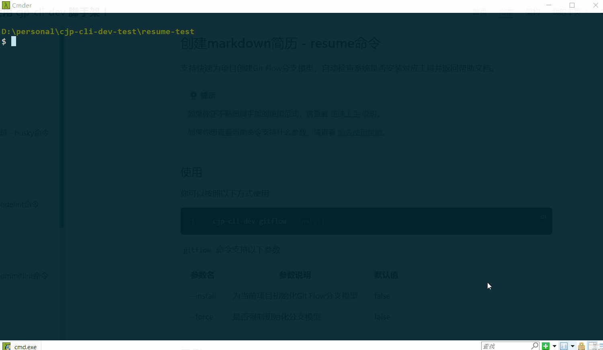
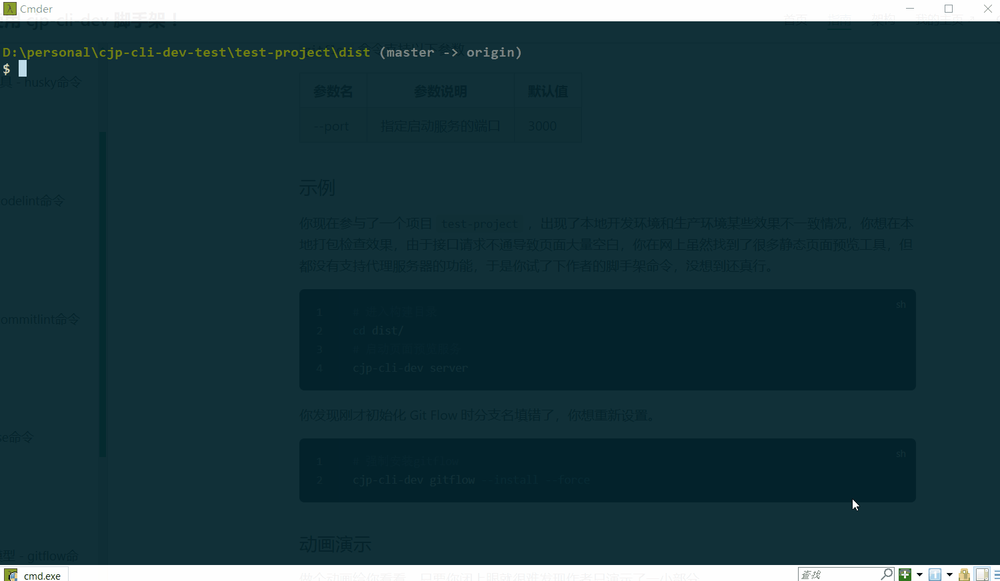
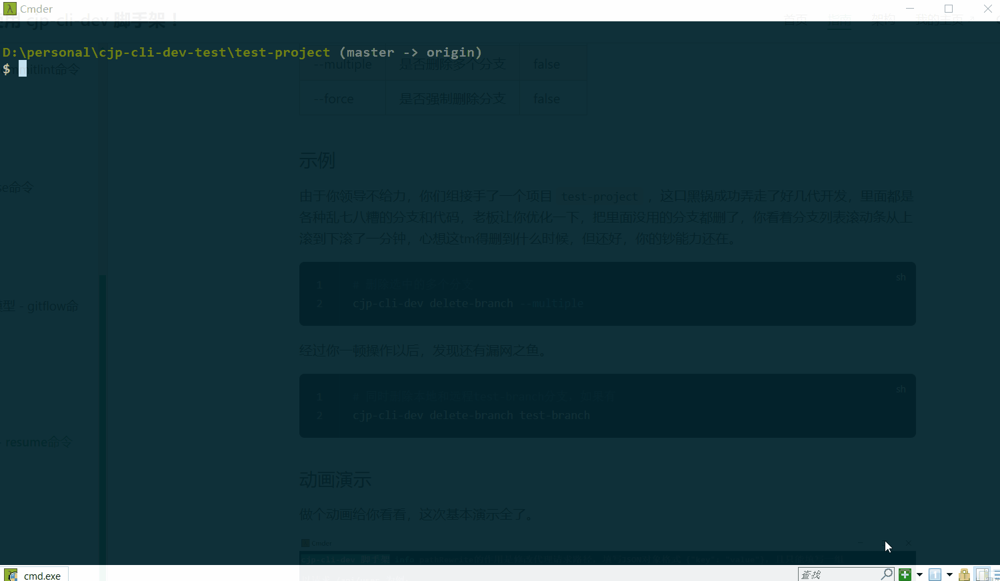

# 其它命令

其它命令包含安装 **husky工具、统一项目代码规范、统一项目提交信息规范、升级项目版本、创建Git Flow分支模型、启动本地页面预览服务、创建markdown简历** 等一系列大杂烩功能。

未来会增加更多能用命令来解决的我能想到的复杂操作，你有想法或者建议可以邮箱联系我。

<details>
  <summary>点击查看作者联系方式</summary>
  <!-- 这里是隐藏的文本内容 -->
  <strong>1303232158@qq.com</strong>
</details>

使用前你需要先安装脚手架，如果你还没有安装，请查看 [快速上手](./getting-started.md) 。

## Git Hooks配置工具 - husky命令

支持快速为项目安装可用的Git Hooks配置工具，兼容稳定版和最新版。

::: tip
如果你还不熟悉脚手架的使用范式，请查看 [快速上手](./getting-started.md#命令使用范式) 说明。

如果你想查看当前命令支持什么参数，请查看 [命令使用帮助](./getting-started.md#命令使用帮助)。
:::

### 使用

你可以按照以下方式使用

```bash
cjp-cli-dev husky --install
```

`husky` 命令支持以下参数

| 参数名    | 参数说明                | 默认值 |
| --------- | ----------------------- | ------ |
| --install | 为当前项目安装husky功能 | false  |
| --add     | 添加新的Git Hook脚本    | []     |
| --set     | 设置Git Hook脚本内容    | []     |

### 示例

你现在创建了一个项目 `test-project` ，想在项目中安装Git Hooks配置工具。执行安装命令，按需选择你想安装稳定版还是最新版即可。

```bash
# 安装husky
cjp-cli-dev husky --install
```

你想在提交代码前进行单元测试。

```bash
# 添加hook（脚本内容需使用引号包裹）
cjp-cli-dev husky --add pre-commit "npm run test"
```

你又不想要单元测试了，想在提交代码前进行代码检查。

```bash
# 设置hook（脚本内容需使用引号包裹）
cjp-cli-dev husky --set pre-commit "npm run lint"
```

### 动画演示

做个动画给你看看，只要你闭上眼就很难发现作者只演示了一小部分。


### 关于

为什么要做这个命令？

因为懒，手动安装也遇到过各式各样的版本兼容和报错失败问题，安装好了还需要一步一步改配置我嫌麻烦。

命令做了什么事情？

1. 检查当前项目是否为node项目
2. 检查当前目录是否为git仓库，如果是则继续，如果不是则执行git init命令初始化
3. 检查当前项目是否安装husky
4. 生成husky版本选项（暂时支持8和最新版本）
5. 安装对应版本到当前项目，修改package.json scripts，生成默认hook脚本
6. 安装完成，提示用法和帮助文档

稳定版和最新版有什么区别？

稳定版使用 `husky 8.x` 版本，最新版大于 `husky >= 9.0` 版本，新版本初始化和设置hook的方式与旧版本不兼容，且新版本要求 `node >= 18.x`，考虑到很多项目都有一定历史，做了旧版本兼容。

## 统一项目代码规范 - codelint命令

支持快速为项目安装统一代码规范和代码格式校验工具，支持仅校验暂存文件，包含eslint、prettier、lint-staged功能，优先使用prettier美化和格式化代码。

::: tip
如果你还不熟悉脚手架的使用范式，请查看 [快速上手](./getting-started.md#命令使用范式) 说明。

如果你想查看当前命令支持什么参数，请查看 [命令使用帮助](./getting-started.md#命令使用帮助)。
:::

### 使用

你可以按照以下方式使用

```bash
cjp-cli-dev codelint --install
```

`codelint` 命令支持以下参数

| 参数名    | 参数说明                   | 默认值 |
| --------- | -------------------------- | ------ |
| --install | 为项目安装代码规范校验工具 | false  |

### 示例

你现在参与了一个项目 `test-project` ，这个项目有好几个人协作开发，但每个人都有自己乱七八糟的写法，导致混乱难以管理且改别人的代码非常恶心。于是你想了个办法统一项目代码风格。

```bash
# 安装codelint
cjp-cli-dev codelint --install
```

### 动画演示

做个动画给你看看，只要你闭上眼就很难发现作者只演示了一小部分。


### 关于

为什么要做这个命令？

因为懒。

命令做了什么事情？

1. 检查当前项目是否为node项目
2. 检查当前项目是否安装eslint/prettier
3. 安装eslint、prettier、lint-staged，生成默认配置
4. 检查用户是否安装husky，如果有则调用cjp-cli-dev husky --add pre-commit "npx lint-staged"添加校验
5. 安装完成，提示用法和帮助文档

## 统一项目提交规范 - commitlint命令

支持快速为项目安装统一提交信息规范校验工具，使用Angular提交规范，配套汉化版终端交互工具，终端调用命令选择规范提交类型和输入提交信息。

::: tip
如果你还不熟悉脚手架的使用范式，请查看 [快速上手](./getting-started.md#命令使用范式) 说明。

如果你想查看当前命令支持什么参数，请查看 [命令使用帮助](./getting-started.md#命令使用帮助)。
:::

### 使用

你可以按照以下方式使用

```bash
cjp-cli-dev commitlint --install
```

`commitlint` 命令支持以下参数

| 参数名    | 参数说明                                 | 默认值 |
| --------- | ---------------------------------------- | ------ |
| --install | 为项目安装Git提交信息Angular规范校验工具 | false  |

### 示例

你现在参与了一个项目 `test-project` ，这个项目多人协作开发，但每个人提交的信息乱七八糟毫无章法，某天老板让你统计下这个版本的代码提交哪些是新增功能、哪些是修Bug、哪些是优化。你有点蛋疼，求助了大佬，大佬也没什么好办法，但他告诉你从现在开始规范提交未来能让你舒坦点。你在网上搜索各种教程，总算知道要在git提交代码时对提交信息进行校验，于是你说服团队成员，并承诺可以让他们更轻松的使用你的规范，而不会额外增加工作量。但你发现要实现这个功能非常麻烦，过程中各种复杂配置导致你出现了无法解决的报错，直到你看到作者的脚手架 `commitlint` 命令满足你的要求，你的嘴角总算压不住了。

```bash
# 安装commitlint
cjp-cli-dev commitlint --install
```

### 动画演示

做个动画给你看看，只要你闭上眼就很难发现作者只演示了一小部分。


### 关于

为什么要做这个命令？

因为懒。

命令做了什么事情？

1. 检查当前项目是否为node项目
2. 检查当前项目中是否安装commitlint
3. 检查node版本，获取对应版本可用package信息
4. 安装commitlint相关包，生成相关配置
5. 安装完成，提示用法和帮助文档

## 升级项目版本 - release命令

支持快速自动升级项目版本，自动生成git变更记录文档。

::: tip
如果你还不熟悉脚手架的使用范式，请查看 [快速上手](./getting-started.md#命令使用范式) 说明。

如果你想查看当前命令支持什么参数，请查看 [命令使用帮助](./getting-started.md#命令使用帮助)。
:::

### 使用

你可以按照以下方式使用

```bash
cjp-cli-dev release --install
```

`release` 命令支持以下参数

| 参数名    | 参数说明                                | 默认值 |
| --------- | --------------------------------------- | ------ |
| --install | 为当前项目安装release-it功能            | false  |
| --patch   | 自动升级patch版本，示例：1.0.0 => 1.0.1 | false  |
| --minor   | 自动升级minor版本，示例：1.0.0 => 1.1.0 | false  |
| --major   | 自动升级major版本，示例：1.0.0 => 2.0.0 | false  |

### 示例

你现在参与了一个项目 `test-project` ，这个项目运行了好几年一直没有规范的版本管理，你接手以后想让他规范起来，经过你的努力，版本管理终于规范起来，你们成功发布了 `1.0.0` 版本。

```bash
# 安装release
cjp-cli-dev release --install
```

老板很赞赏你，拍了拍你的肩膀，告诉你继续加油争取这周再发一个小版本，于是你们持续996，终于可以发布 `1.1.0` 版本，但还要你手动去修改 `package.json` 的 `version`，这怎么忍？你气的不小心按到了脚手架命令，才发现原来它会自动帮你修改版本，还会帮你创建这个版本的提交记录文档。

```bash
# 升级minor版本
cjp-cli-dev release --minor
```

`1.1.0` 版本发布上线了，你不放心的上线看了看，果然被你发现有个小Bug，你趁着页面还没反应过来赶紧跟上了一个 `1.1.1` 修复版本，然后反手点了一根蚊香，深藏功与名。

```bash
# 升级patch版本
cjp-cli-dev release --patch
```

项目在你们持续几年不懈的努力和付出下业务快速扩张，老板刚进公司开的雅阁也换成了大奔，刚才你路过停车场看见老板从大劳上下来，老板也看见了你，并向你走了过来，不停地对你发起赞赏，还给你颁发了优秀员工称号，同时给你带来项目要大升级打算发布 `2.0.0` 版的好消息，嘱咐你好好干公司一定不会亏待你。而你依旧持续着996的生活，工资一毛没涨，看着身边的同事辞去迎新，你拿着手里那三年来从未变过的工资条，不禁有些恍惚，感叹 “铁打的营盘，流水的兵” ，手里的键盘忍了又忍还是按了下去，但紧接着键盘上传来的很细微的回声却让你感觉到振聋发聩，它仿佛老板的狗腿子对你吐了一口唾沫 “呸！你就是个外包低级杂工”，眼泪最终还是不争气的从嘴角流了下来，你大口啃咬着左手上拿着的已经凉透了的肯德基外卖，心想 “管他呢，这年头有口饭吃就不错了”。

```bash
# 升级major版本
cjp-cli-dev release --major
```

### 动画演示

做个动画给你看看，只要你闭上眼就很难发现作者只演示了一小部分。


### 关于

为什么要做这个命令？

因为懒。

命令做了什么事情？

1. 检查当前项目是否node项目
2. 检查是否安装release-it
3. 检查node版本，生成可用的release-it相关包版本
4. 安装release-it相关包到当前项目
5. 生成.release-it.json配置
6. 修改package.json添加scripts
7. 安装完成，提示用法和帮助文档

## 创建Git Flow分支模型 - gitflow命令

支持快速为项目创建Git Flow分支模型，自动检查系统是否安装对应工具并返回帮助文档。

::: tip
如果你还不熟悉脚手架的使用范式，请查看 [快速上手](./getting-started.md#命令使用范式) 说明。

如果你想查看当前命令支持什么参数，请查看 [命令使用帮助](./getting-started.md#命令使用帮助)。
:::

### 使用

你可以按照以下方式使用

```bash
cjp-cli-dev gitflow --install
```

`gitflow` 命令支持以下参数

| 参数名    | 参数说明                         | 默认值 |
| --------- | -------------------------------- | ------ |
| --install | 为当前项目初始化Git Flow分支模型 | false  |
| --force   | 是否强制初始化分支模型           | false  |

### 示例

你现在参与了一个项目 `test-project` ，这个项目有好几个人协作开发，由于你们没有规范的分支管理，导致各种冲突和管理困难，偶然逛社区的时候你看到 Git Flow 分支管理，你觉得非常满足当下需要，刚好脚手架命令支持你的需求。

```bash
# 安装gitflow
cjp-cli-dev gitflow --install
```

你发现刚才初始化 Git Flow 时分支名填错了，你想重新设置。

```bash
# 强制安装gitflow
cjp-cli-dev gitflow --install --force
```

### 动画演示

做个动画给你看看，只要你闭上眼就很难发现作者只演示了一小部分。


### 关于

灵感来源于 [git-flow](https://github.com/nvie/gitflow) 。

为什么要做这个命令？

因为懒。

命令做了什么事情？

1. 检查用户是否已安装git-flow（windows安装git自带，macOS返回安装链接），提示并等待用户安装完成按回车继续
2. 检查当前目录是否为git仓库，如果是则继续，如果不是则执行git init命令初始化
3. 判断force不存在，检查是否已经初始化过git flow，如果是则终止执行，否则继续
4. 用户选择使用默认git flow分支模型还是自定义分支模型
5. 选择默认，执行git flow init -d初始化默认分支模型 `master/develop/release/feature/hotfix/bugfix/support...`
6. 选择自定义，执行git flow init让用户输入自定义分支模型
7. 完成git flow分支模型初始化，返回帮助文档

## 创建markdown简历 - resume命令

支持创建markdown简历，提供前端简历模板，支持导出one-light主题样式PDF。

::: tip
导出PDF能力依赖chrome浏览器，首次使用该命令的 `--export` 功能时需提供chrome浏览器安装路径，如果chrome安装路径被修改，则需使用 `--resetChromePath` 参数重置安装路径。

注意：由于依赖包 `puppeteer-core` 使用了 `node` 一些新特性，要求 `node >= 18.x` ，否则会报错。
:::

::: tip
如果你还不熟悉脚手架的使用范式，请查看 [快速上手](./getting-started.md#命令使用范式) 说明。

如果你想查看当前命令支持什么参数，请查看 [命令使用帮助](./getting-started.md#命令使用帮助)。
:::

### 使用

你可以按照以下方式使用

```bash
cjp-cli-dev resume --install
```

`resume` 命令支持以下参数

| 参数名            | 参数说明                     | 默认值 |
| ----------------- | ---------------------------- | ------ |
| --install         | 下载markdown简历模板         | false  |
| --export          | 将markdown简历转为PDF        | false  |
| --resetChromePath | 重置chrome浏览器安装路径缓存 | false  |

### 示例

今天老板突然通知你被炒鱿鱼了，你心里烦得很，看着为数不多的钱包余额，准备再找新的工作。你把以前投过的docx简历改了又改总算满意，在心仪的公司投递后却被打回，留言是本司简历仅接收PDF格式。于是你开始在网上找免费的docx转pdf方法，结果都是乱七八糟，一气之下你付费了某迅，发现还是差强人意，作者得知你的惨痛经历后连夜在脚手架中开发了 `resume` 命令，安慰你专业开发都用 `markdown` 写简历，还吹牛逼说这绝对是你用过的最好的 `.md` 转 `.pdf` 工具，关键还免费！你在职场失意的心情下被忽悠住了，觉得很有歪理，心里暗暗笃定也要做专业人士。

```bash
# 下载markdown简历模板
cjp-cli-dev resume --install
```

经过你小半天的偷懒，总算把原来的简历内容cv到markdown简历中了，于是你想试试作者有没有吹牛逼，是不是真的既免费又能导出格式好看的PDF。

```bash
# 导出.md简历为.pdf简历
cjp-cli-dev resume --export
```

有了这个神器，你顺利找到了新的工作，在新公司工作几天后突然你的chrome浏览器出现错误打不开了，于是你重装了chrome浏览器，这次安装时你选择了新的安装路径，你想再次尝试命令导出PDF时却发现报错了，你骂骂咧咧的吐出几句国粹，把作者屌了一顿，并使用[钞能力](../sponsor/#钞能力)强迫他提供重置chrome浏览器安装路径的能力。

```bash
# 重置chrome浏览器安装路径缓存
cjp-cli-dev resume --resetChromePath
```

### 动画演示

做个动画给你看看，鉴于你的[钞能力](../sponsor/#钞能力)作者多演示了导出功能。



### 关于

为什么要做这个命令？

找免费转换工具找累了。

命令做了什么事情？

- --install

1. 输入姓名、手机号、邮箱、职位、年龄、工龄、求职地点等基础信息
2. 询问是否需要证件照，提示将证件照拷贝到当前目录，支持jpg/png
3. 列出当前目录中的图片文件供用户选择
4. 将选择的证件照转为base64插入到img src
5. 生成markdown简历模板到当前目录，并通过ejs渲染
6. 提示用户可通过脚手架命令导出pdf
7. 返回markdown基础语法帮助文档

- --export

1. 获取当前目录中的md文件并列出选项
2. 首次使用导出提示用户依赖chrome浏览器，需提供chrome安装路径
3. 将用户输入的chrome安装路径写入脚手架缓存
4. 读取用户选择导出的md文件，通过marked转为html格式
5. 驱动chrome浏览器导出html为PDF

## 本地页面预览 - server命令

通过express启动本地页面预览服务，支持http请求代理，支持代理多个服务器。

::: tip
灵感来源于 `webpack-dev-server` ，源码也是通过 `express + http-proxy-middleware` 实现。
:::

::: tip
如果你还不熟悉脚手架的使用范式，请查看 [快速上手](./getting-started.md#命令使用范式) 说明。

如果你想查看当前命令支持什么参数，请查看 [命令使用帮助](./getting-started.md#命令使用帮助)。
:::

### 使用

你可以按照以下方式使用

```bash
cjp-cli-dev server
```

`server` 命令支持以下参数

| 参数名 | 参数说明           | 默认值 |
| ------ | ------------------ | ------ |
| --port | 指定启动服务的端口 | 3000   |

### 示例

你现在参与了一个项目 `test-project` ，出现了本地开发环境和生产环境某些效果不一致情况，你想在本地打包检查效果，由于接口请求不通导致页面大量空白，你在网上虽然找到了很多静态页面预览工具，但都没有支持代理服务器的功能，于是你试了下作者的脚手架命令，没想到还真行。

```bash
# 进入构建目录
cd dist/
# 启动页面预览服务
cjp-cli-dev server
```

你体验完觉得很满意，在你接连赞叹了三个“好！好！好！”之后又启动了一个新的预览服务，这次却报错了，于是你又使用[钞能力](../sponsor/#钞能力)强迫作者增加了指定端口能力。

```bash
# 指定 3001 端口启动页面预览服务
cjp-cli-dev server --port 3001
```

### 动画演示

做个动画给你看看，这次基本演示全了。



### 关于

为什么要做这个命令？

因为别的工具预览服务都不那么好用。

命令做了什么事情？

1. 检查index.html是否存在
2. 用户输入publicPath
3. 询问是否有代理需求，是则进入4，否则直接到8
4. 询问代理多服务器还是单服务器
5. 多，填写多服务代理配置
6. 单，填写单服务器代理地址和重写规则
7. 生成代理中间件，启动proxy中间件代理
8. 启动express预览服务

## 删除分支 - delete-branch命令

支持快速删除本地和远端分支，可多选删除。

::: tip
如果你还不熟悉脚手架的使用范式，请查看 [快速上手](./getting-started.md#命令使用范式) 说明。

如果你想查看当前命令支持什么参数，请查看 [命令使用帮助](./getting-started.md#命令使用帮助)。
:::

### 使用

你可以按照以下方式使用

```bash
cjp-cli-dev delete-branch [branchName]
```

`server` 命令支持以下参数

| 参数名     | 参数说明         | 默认值 |
| ---------- | ---------------- | ------ |
| --multiple | 是否多选分支删除 | false  |
| --force    | 是否强制删除分支 | false  |

### 示例

由于你领导不给力，你们组接手了一个项目 `test-project` ，这口黑锅成功弄走了好几代开发，里面都是各种乱七八糟的分支和代码，老板让你优化一下，把里面没用的分支都删了，你看着分支列表滚动条从上滚到下滚了一分钟，心想这tm得删到什么时候，但还好，你的[钞能力](../sponsor/#钞能力)还在。

```bash
# 删除选中的多个分支
cjp-cli-dev delete-branch --multiple
```

经过你一顿操作以后，发现还有漏网之鱼。

```bash
# 同时删除本地和远程test-branch分支，如果有
cjp-cli-dev delete-branch test-branch
```

### 动画演示

做个动画给你看看，这次基本演示全了。



### 关于

为什么要做这个命令？

因为真遇到过这种垃圾项目，手动删起来贼慢。

命令做了什么事情？

1. 支持参数，branchName、force、multiple
2. multiple参数为true，列出所有本地和远端分支供用户选择
3. multiple为false，单删模式，输入命令 + branchName即可
4. 检查force参数，单删和多删都生效，为true则不进行二次确认直接删除，false则进行二次确认
5. 检查本地和远端要删除的分支是否存在，存在则删除，不存在则跳过
6. 完成删除功能，提示成功
