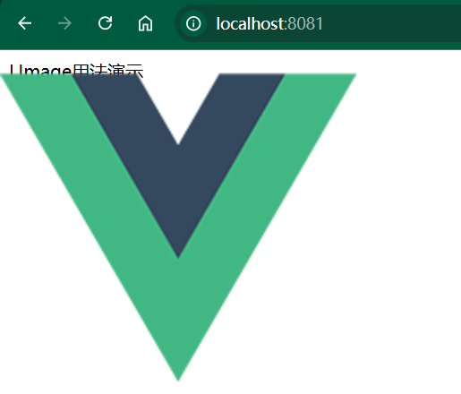

# 模板

模板也是脚手架的核心环节，你可以按照自己的需求开发模板来实现快速复用。

::: tip
演示模板参考代码 [演示模板仓库地址](https://gitee.com/Mr_Mikey/cjp-cli-dev-template)
:::

::: tip
推荐你也先创建一个 Git 仓库，然后将模板提交到仓库中统一管理。
:::

## 概念解释

- **标准模板**：仅依赖脚手架命令提供的变量参数自动进行 `ejs` 渲染，不额外依赖其它参数和操作。
- **自定义模板**：提供自定义脚本让脚手架命令运行，可自行决定渲染方式和 `ejs变量` 属性等。

## 如何创建项目模板

项目模板分为 `标准模板` 和 `自定义模板` ，在 [概念解释](#概念解释) 中强调了定义，注意，`自定义模板` 和`标准模板` 的区别是 `自定义模板` 需要额外提供一个 `index.js` 作为入口文件来自定义渲染模板内容，这在脚手架命令源码中是规定好的。

::: tip
项目模板提供给脚手架 `init` 命令进行使用，查看 [init命令](./core-command.md#初始化-init命令) 使用。
:::

### 创建标准项目模板

1、创建模板目录如 `cjp-cli-dev-template-vue3` ，并执行npm初始化。

::: tip
文件夹名就是你的npm包名，按你自己喜欢的来命名，写什么都行，只要npm上没这个包就可以，否则发不上去。
:::

```bash
cd cjp-cli-dev-template-vue3
npm init -y
```

2、在 `cjp-cli-dev-template-vue3` 目录中创建 `template` 文件夹，找个你认为优秀的项目作为模板，这里我用 `vue-cli` 下载的 `vue3-vite` 项目作为演示，把模板内的所有文件都复制到 `template` 文件夹中。

此时你的目录结构应该长这样，其中 `template` 文件夹中的文件内容则作为脚手架命令最终下载的项目源文件。

```
cjp-cli-dev-template-vue3     # 模板包名
├─ template                   # 模板拷贝目录
│  ├─ src                     # 项目源码
│  ├─ package.json            # 项目package.json
│  └─ ...                     # 项目其他文件
└─ package.json               # 模板package.json
```

3、用过 `vue-cli` 下载模板你应该清楚，你输入的项目名称和版本号最终会写入到下载好的模板 `package.json` 中，它的实现方式就是通过 `ejs` 来解析和渲染最终的模板。

::: tip
`ejs变量` 的语法为 `<%= 变量名 %>` 。

对 `ejs` 有疑问？查看官方文档 [ejs](https://www.npmjs.com/package/ejs) 。
:::

这一点脚手架 `init` 命令的实现方式和 `vue-cli` 是一致的，所以我们也需要修改项目 `package.json` ，将对应的位置替换成 `ejs变量` 。

```json
{
  "name": "<%= projectName %>",
  "version": "<%= projectVersion %>",
  "...省略其他"
}
```

当然，你提供的项目模板代码中其它位置如果有需要也可以通过修改为 `ejs变量` 的形式来进行替换，最终 `init` 命令执行时会扫描所有文件，并将用到ejs变量的地方替换成真实内容。

`init` 命令安装 `标准项目模板` 时传递给 `ejs` 的变量有以下几个，你可以按需使用。

| 参数名          | 参数说明                                                       |
| --------------- | -------------------------------------------------------------- |
| type            | 安装类型是项目还是组件库，项目返回project，组件库返回component |
| projectName     | 执行安装命令时你输入的项目名称                                 |
| projectVersion  | 执行安装命令时你输入的项目版本                                 |
| projectTemplate | 执行安装命令时你选择安装的项目npm包名                          |

4、模板创建好后，你需要将模板发布到npm上，并配置 [本地JSON](./configuration.md#项目-组件库模板配置) 或者 [MongoDB](./configuration.md#mongodb配置模板) 后即可执行 `init` 命令安装使用。

::: tip
发布npm前，请先访问 [npm官网](https://www.npmjs.com/)，确保网络连接正常，然后执行 `npm login` 进行登录，否则会发布失败。

发布新的版本前，请先提交代码，并更新版本号。
:::

```bash
# 进入目录
cd cjp-cli-dev-template-vue3
# 发布npm包
npm publish
```

### 创建自定义项目模板

在 [概念解释](#概念解释) 中提到过 `自定义模板` 和`标准模板` 的区别是 `自定义模板` 需要额外提供一个 `index.js` 作为入口文件来自定义渲染模板内容，这在脚手架命令源码中是规定好的。

1、与创建 `标准项目模板` 一样，创建 `自定义项目模板` 目录如 `cjp-cli-dev-template-vue3-custom` ，并执行npm初始化。

::: tip
文件夹名就是你的npm包名，按你自己喜欢的来命名，写什么都行，只要npm上没这个包就可以，否则发不上去。
:::

```bash
cd cjp-cli-dev-template-vue3-custom
npm init -y
```

2、在 `cjp-cli-dev-template-vue3-custom` 目录中创建 `template` 文件夹，找个你认为优秀的项目作为模板，这里我用 `vue-cli` 下载的 `vue3-vite` 项目作为演示，把模板内的所有文件都复制到 `template` 文件夹中。

与创建 `标准项目模板` 不同的是，你还需要在 `cjp-cli-dev-template-vue3-custom` 目录中创建 `index.js` 文件，它将作为自定义渲染的入口文件。

此时你的目录结构应该长这样，其中 `template` 文件夹中的文件内容则作为脚手架命令最终下载的项目源文件。

```
cjp-cli-dev-template-vue3-custom     # 模板包名
├─ template                          # 模板拷贝目录
│  ├─ src                            # 项目源码
│  ├─ package.json                   # 项目package.json
│  └─ ...                            # 项目其他文件
├─ index.js                          # 模板自定义渲染入口文件
└─ package.json                      # 模板package.json
```

3、你需要编写自定义渲染逻辑，约定为在 `index.js` 中使用 `commonjs` 规范导出 `install` 方法，最终执行 `init` 命令在你选择安装 `自定义项目模板` 时，将会读取这个 `index.js` 文件，并执行 `install` 方法进行安装。

`install` 方法接收 `options` 参数，`init` 命令安装 `自定义项目模板` 时会将以下参数传递给`install` 方法，你可以按需使用。

| 参数名       | 参数说明                                                                      |
| ------------ | ----------------------------------------------------------------------------- |
| templateInfo | 模板配置信息对象，查看 [模板字段说明](./configuration.md#项目-组件库模板配置) |
| projectInfo  | 项目信息对象，包含 [标准项目模板](#创建标准项目模板) 接收的全部属性           |
| sourcePath   | 模板源路径                                                                    |
| targetPath   | 安装目标路径                                                                  |

举个例子，假设我想在安装 `自定义项目模板` 时，增加输入项目描述的选项，请参考以下代码实现，你可以尝试加入更多渲染逻辑，最终需要 `commonjs` 规范导出的 `install` 方法即可。

```js
const {
  prompt, // 终端询问交互
  fse, // 文件操作
  ejs, // ejs渲染
  glob, // 文件匹配
  spawnAsync, // 执行进程
} = require("@cjp-cli-dev/utils"); // 工具方法 - 你需要先安装@cjp-cli-dev/utils，也可以自己去npm找对应包安装

// 白名单命令，不在此白名单中的命令都需要确认是否执行，防止用户插入风险操作，如：rm -rf等
const COMMAND_WHITELIST = [
  "npm", // Node.js的包管理工具
  "cnpm", // npm的中国镜像加速版
  "yarn", // 另一个流行的JavaScript包管理工具
  "pnpm", // 性能更优的npm替代品
  "node", // Node.js运行环境
]

// 代码来源于 cjp-cli-dev/commands/init/lib/index.js 下载和渲染逻辑
async function install(options) {
  const projectPrompts = [];
  // 假设自定义项目模板需要额外增加描述信息填写
  const descriptionPrompt = {
    type: "input",
    name: "description",
    default: "",
    message: "请输入项目描述：",
    validate: function (v) {
      const done = this.async();

      setTimeout(() => {
        if (!v) {
          done(`请输入项目描述信息`);
          return;
        }

        done(null, true);
      }, 0);
    },
  };
  projectPrompts.push(descriptionPrompt);
  // 获取用户输入结果
  const projectInfoInput = await prompt(projectPrompts);

  const { sourcePath, targetPath, projectInfo, templateInfo } = options;

  // 存入projectInfo中，提供给ejs使用
  projectInfo.description = projectInfoInput.description;

  try {
    // 确保这两个目录都存在，如果不存在会自动创建
    fse.ensureDirSync(sourcePath);
    fse.ensureDirSync(targetPath);
    // 拷贝模板代码到当前目录
    fse.copySync(sourcePath, targetPath);

    // ejs忽略文件夹，默认node_modules，可在数据库中配置ignore属性（数组）
    const templateIgnore = templateInfo.ignore || [];
    const ignore = ["**/node_modules/**", ...templateIgnore];
    // 模板安装完成后进行ejs渲染，替换掉ejs变量
    await ejsRender({ ignore, targetPath, projectInfo, templateInfo });

    // 模板安装完成后执行安装和启动模板
    const { installCommand, startCommand } = templateInfo;

    // 执行安装命令
    const installResult = await parsingCommandExec(
      installCommand,
      "installCommand",
      `检测到installCommand存在，执行：${installCommand}`
    );

    if (installResult === 0) {
      console.log("依赖安装成功");
    } else {
      // 抛出错误，阻断后面执行
      throw new Error("依赖安装失败");
    }

    // 执行启动命令
    await parsingCommandExec(
      startCommand,
      "startCommand",
      `检测到startCommand存在，执行：${startCommand}`
    );
  } catch (err) {
    // 如果报错，抛出错误
    throw err;
  }
}

// 使用ejs渲染模板
async function ejsRender(options = {}) {
  const { targetPath: cwd, projectInfo } = options;

  try {
    // 获取匹配的文件
    const files = await glob("**", {
      cwd,
      ignore: options.ignore || "node_modules/**", // 忽略内容
      nodir: true, // 不要文件夹
      dot: true, // 包含隐藏文件
    });

    if (!files || files.length === 0) {
      throw new Error("glob没有匹配到文件");
    }

    // 遍历文件并渲染 EJS 模板
    await Promise.all(
      files.map(async (file) => {
        const filePath = path.join(cwd, file);
        try {
          const result = await ejs.renderFile(filePath, projectInfo, {});
          // 写入渲染后的结果
          fse.writeFileSync(filePath, result);
        } catch (err) {
          throw new Error(`EJS 渲染文件 ${filePath} 出错: ${err.message}`);
        }
      })
    );
  } catch (err) {
    // 捕获并处理所有错误
    console.error("ejsRender 执行出错：", err.message);
    throw err; // 抛出错误，以便外部调用处理
  }
}

/**
 * 解析并执行命令
 * @param {*} command 命令内容，如npm install、npm run dev
 * @param {*} field 接口数据中配置命令的字段名，如installCommand、startCommand
 * @param {*} logInfo 提示信息
 * @returns
 */
async function parsingCommandExec(command, field, logInfo) {
  // 命令不存在直接return
  if (!command) {
    console.log(`${field} 不存在，请查看数据是否存在该配置`);
    return;
  }
  // 打印提示信息
  console.log(logInfo);
  // 解析命令并执行
  const cmds = command.split(" ");
  const cmd = checkCommandInWhitelist(cmds[0]);
  const args = cmds.slice(1); // 从索引1开始到数组结束的所有元素
  const result = await spawnAsync(cmd, args, {
    stdio: "inherit",
    cwd: process.cwd(),
  });

  return result;
}

// 检查命令是否在白名单
function checkCommandInWhitelist(command) {
  if (!COMMAND_WHITELIST.includes(command)) {
    // 如果命令不在白名单
    throw new Error(
      `命令 ${command} 不在白名单中，可能存在风险，已阻止程序运行`
    );
  }

  return command;
}

// 使用commmonjs导出install方法
module.exports = install;
```

4、编写完自定义渲染逻辑后，你依然需要通过 `ejs变量` 来替换并渲染最终结果，比如修改 `package.json` 中的项目名称和版本号，还有刚才示例代码中新加入的项目描述选项。

::: tip
`ejs变量` 的语法为 `<%= 变量名 %>` 。

对 `ejs` 有疑问？查看官方文档 [ejs](https://www.npmjs.com/package/ejs) 。
:::

```json
{
  "name": "<%= projectName %>",
  "version": "<%= projectVersion %>",
  "description": "<%= description %>",
  "...省略其他"
}
```

当然，你提供的项目模板代码中其它位置如果有需要也可以通过修改为 `ejs变量` 的形式来进行替换，最终 `init` 命令执行时会扫描所有文件，并将用到ejs变量的地方替换成真实内容。

5、模板创建好后，你需要将模板发布到npm上，并配置 [本地JSON](./configuration.md#本地json配置模板) 或者 [MongoDB](./configuration.md#mongodb配置模板) 后即可执行 `init` 命令安装使用。

::: tip
发布npm前，请先访问 [npm官网](https://www.npmjs.com/)，确保网络连接正常，然后执行 `npm login` 进行登录，否则会发布失败。

发布新的版本前，请先提交代码，并更新版本号。
:::

```bash
# 进入目录
cd cjp-cli-dev-template-vue3-custom
# 发布npm包
npm publish
```

## 如何创建组件库模板

本节演示创建 vue3 组件库模板的过程，仅供参考。

::: tip
你也可以自己尝试创建一个组件库模板，只需要遵循脚手架约定的目录结构即可，约定为将组件库源码放在 `template` 目录中，并在 `template` 目录下创建 `examples` 目录，将最终的预览 html 页面放在该目录的 `dist` 目录中。

**目前 `publish` 命令的逻辑是在发布组件库时将读取模板 `/examples/dist/` 下的html文件**。

关于如何创建通用组件库模板这里不做赘述。参考以下文章：

- <https://cloud.tencent.com/developer/article/1598054>
- <https://blog.csdn.net/2401_83384536/article/details/140849379>
- <https://worktile.com/kb/p/3633101>
:::

1、创建模板目录如 `cjp-cli-dev-template-vue3-component` ，并执行npm初始化。

::: tip
文件夹名就是你的npm包名，按你自己喜欢的来命名，写什么都行，只要npm上没这个包就可以，否则发不上去。
:::

```bash
cd cjp-cli-dev-template-vue3-component
npm init -y
```

2、在 `cjp-cli-dev-template-vue3-component` 目录中创建 `template` 文件夹，找个你认为优秀的项目作为模板，这里我用提前准备好的 [vue3-webpack组件库模板](https://gitee.com/Mr_Mikey/cjp-cli-dev-template/tree/master/cjp-cli-dev-template-vue3-component/template) 作为演示，把模板内的所有文件都复制到 `template` 文件夹中。

此时你的目录结构应该长这样，其中 `template` 文件夹中的文件内容则作为脚手架命令最终下载的项目源文件。

```
cjp-cli-dev-template-vue3-component     # 模板包名
├─ template                             # 模板拷贝目录
│  ├─ src                               # 组件项目源码
│  ├─ vue.config.js                     # 组件项目配置
│  ├─ package.json                      # 组件项目package.json
│  └─ ...                               # 组件项目其他文件
└─ package.json                         # 模板package.json
```

3、用过 `vue-cli` 下载模板你应该清楚，你输入的项目名称和版本号最终会写入到下载好的模板 `package.json` 中，它的实现方式就是通过 `ejs` 来解析和渲染最终的模板。

::: tip
`ejs变量` 的语法为 `<%= 变量名 %>` 。

对 `ejs` 有疑问？查看官方文档 [ejs](https://www.npmjs.com/package/ejs) 。
:::

这一点脚手架 `init` 命令的实现方式和 `vue-cli` 是一致的，所以我们也需要修改项目 `package.json` ，将对应的位置替换成 `ejs变量` 。

```json
{
  "name": "<%= projectName %>",
  "version": "<%= projectVersion %>",
  "description": "<%= componentDescription %>",
  "main": "dist/<%= projectName %>.umd.js",
  "module": "dist/<%= projectName %>.esm.js",

  // 注意这个files很重要，将你想要发布到npm上的所有文件和路径都填上，否则发布后将会缺失这些文件
  "files": [
    "build",
    "dist",
    "examples/",
    "public/",
    "src",
    "test",
    ".browserslistrc",
    ".eslintrc.js",
    ".travis.yml",
    "babel.config.js",
    "jest.config.js",
    "jsconfig.json",
    "README.md",
    "tsconfig.json",
    "vue.config.js"
  ]

  "...省略其他"
}
```

当然，你提供的组件模板代码中其它位置如果有需要也可以通过修改为 `ejs变量` 的形式来进行替换，最终 `init` 命令执行时会扫描所有文件，并将用到ejs变量的地方替换成真实内容。

`init` 命令安装 `组件模板` 时传递给 `ejs` 的变量有以下几个，你可以按需使用。

| 参数名               | 参数说明                                                       |
| -------------------- | -------------------------------------------------------------- |
| type                 | 安装类型是项目还是组件库，项目返回project，组件库返回component |
| projectName          | 执行安装命令时你输入的组件项目名称                             |
| projectVersion       | 执行安装命令时你输入的组件项目版本                             |
| projectTemplate      | 执行安装命令时你选择安装的组件项目npm包名                      |
| componentDescription | 执行安装命令时你输入的组件项目描述                             |

4、模板创建好后，你需要将模板发布到npm上，并配置 [本地JSON](./configuration.md#项目-组件库模板配置) 或者 [MongoDB](./configuration.md#mongodb配置模板) 后即可执行 `init` 命令安装使用。

::: tip
发布npm前，请先访问 [npm官网](https://www.npmjs.com/)，确保网络连接正常，然后执行 `npm login` 进行登录，否则会发布失败。

发布新的版本前，请先提交代码，并更新版本号。
:::

```bash
# 进入目录
cd cjp-cli-dev-template-vue3-component
# 发布npm包
npm publish
```

到这一步我们基本完成了组件库模板创建，接着我们需要在 `template` 目录下创建预览代码目录 `examples` ， `examples/dist` 中的内容就是组件库对外展示的预览界面，有多个预览组件，则生成多个html文件即可。

### 开发组件预览页面功能

前面提供的 [vue3-webpack组件库](https://gitee.com/Mr_Mikey/cjp-cli-dev-template/tree/master/cjp-cli-dev-template-vue3-component/template) 这个演示模板中已经存在 `examples` 和相关代码，你可以打开文件进行对照，大致过程如下。

1、通过 `vue-cli` 安装一个vue3模板作为演示，把下载的所有文件都拷贝到预览代码目录 `examples` 中。

2、在前面 [vue3-webpack组件库](https://gitee.com/Mr_Mikey/cjp-cli-dev-template/tree/master/cjp-cli-dev-template-vue3-component/template) 这个演示模板中，运行构建命令会将结果输出到 `/dist/` 目录中，构建的文件名则是你在执行 `init` 命令时输入的名称，我们需要在预览项目 `examples/src/main.js` 中全局引入演示组件库。

```js
import { createApp } from 'vue'
import App from './App.vue'
// 这里也需要替换成 ejs变量，最终打包文件将会由你输入的项目名称来决定
import LegoComponents from '../../dist/<%= projectName %>.esm'

const app = createApp(App)
// 注册全局组件
app.use(LegoComponents)

app.mount('#app')
```

3、修改 `App.vue` ，增加测试代码，演示模板中提供了 `l-image` 组件。

```js
<template>
  <div id="index">
    <div>LImage用法演示</div>
    <!-- 替换成你的图片路径或网络图片 -->
    <l-image :src="require('./assets/logo.png')" />
  </div>
</template>
```

4、创建 `vue.config.js`，增加多页面打包配置，通过这种方式来实现多个组件预览的功能。

```js
const { defineConfig } = require('@vue/cli-service')

module.exports = defineConfig({
  transpileDependencies: true,
  publicPath: './',
  // 多页面打包配置
  pages: {
    index: {
      entry: "./src/main.js",
      template: './public/index.html',
    },
    // 你可以在 examples/src/ 目录下创建 main2.js ，并运行npm run build来进行测试
    // 检查 dist 目录你将看到两个html文件。
    index2: {
      entry: "./src/main2.js",
      template: './public/index.html',
    }
  }
})
```

完成后升级 `cjp-cli-dev-template-vue3-component` 版本号，然后重新发布。**发布前记得删除 `examples` 目录下的 `node_modules` ，嵌套结构不会被忽略**。

```bash
# 进入组件库模板目录
cd cjp-cli-dev-template-vue3-component
# 更新patch版本（注意需要先提交代码，否则会失败，你也可以手动修改package.json版本号）
npm version patch
# 执行发布
npm publish
```

### 测试预览页面功能

创建一个文件夹如 `test-component` ，进入该目录，选择安装组件库模板。

```bash
cd test-component
cjp-cli-dev init test-component
```

确保 `test-component` 已经安装依赖，执行构建命令打包组件库代码。

```bash
npm install
npm run build
```

确保 `examples` 中已经安装依赖，前面的步骤都完成后，启动项目你应该能看到以下页面内容。

```bash
cd examples
npm install
npm run serve
```



打包输出最终的预览 html 文件，脚手架 `publish` 命令执行时会读取这些文件。

```bash
cd examples
npm run build
```

这样就完成了组件库模板的创建和预览功能，再次强调你可以自定义组件库模板，遵循脚手架约定的目录结构即可。

> 约定为将组件库源码放在 `template` 目录中，并在 `template` 目录下创建 `examples` 目录，将最终的预览 html 页面放在该目录的 `dist` 目录中。目前脚手架 `publish` 命令会读取这个路径中的 html 文件。

## 如何创建页面模板

页面模板同样分为 `标准模板` 和 `自定义模板` ，在 [概念解释](#概念解释) 中强调了定义，注意，`自定义模板` 和`标准模板` 的区别是 `自定义模板` 需要额外提供一个 `index.js` 作为入口文件来自定义渲染模板内容，这在脚手架命令源码中是规定好的。

::: tip
页面模板提供给脚手架 `add` 命令进行使用，查看 [add命令](./core-command.md#复用代码-add命令) 使用。
:::

::: tip
请注意，`add` 命令目前仅支持vue项目。
:::

### 创建标准页面模板

1、创建模板目录如 `cjp-cli-dev-template-vue3-page` ，并执行npm初始化。

::: tip
文件夹名就是你的npm包名，按你自己喜欢的来命名，写什么都行，只要npm上没这个包就可以，否则发不上去。
:::

```bash
cd cjp-cli-dev-template-vue3-page
npm init -y
```

2、在 `cjp-cli-dev-template-vue3-page` 目录中创建 `template` 文件夹，并在 `template` 文件夹中创建页面，你可以选择创建单个页面或者多个页面作为模板，但要求**页面相关的代码都存放到一个目录中**，模板还是使用 `ejs` 渲染，你可以按需替换内容为 `ejs变量`。

::: tip
`ejs变量` 的语法为 `<%= 变量名 %>` 。

对 `ejs` 有疑问？查看官方文档 [ejs](https://www.npmjs.com/package/ejs) 。
:::

`add` 命令安装 `标准页面模板` 时传递给 `ejs` 的变量有以下，你可以按需使用。

| 参数名   | 参数说明 |
| -------- | -------- |
| pageName | 页面名称 |

假设你现在有一个 `home` 页面需要大量复用，通过 `vue-cli` 你下载了一个标准vue模板如 `test-project`，你把 `home` 页面相关的依赖都拷贝到 `test-project/src/view/home` 目录下，紧接着你通过 `npm run dev` 命令启动项目调试，确认页面正确显示没有报错后就可以作为模板发布了，页面内容示例代码如下。

```js
<template>
  <div class="<%= pageName %>"><%= pageName %></div>
<template>

<script name="<%= pageName %>">
  {/* 这是我的页面逻辑 */}
</script>

<style scoped>
  .<%= pageName %> {
    color: red;
  }
</style>
```

接着你可以将 `test-project` 所有文件都复制到 `template` 文件夹中。

::: tip
如果你想发布多个页面作为模板，推荐将 `test-project` 所有文件都复制到 `template` 文件夹中，你可以在 `test-project/src/view/` 目录下创建多个页面，如再创建一个 `home2` 页面，只需在 [配置模板字段](./configuration.md#页面模板字段说明) 时增加 `targetPath` 配置指定你想安装哪个页面模板即可。
:::

此时你的目录结构应该长这样，其中 `template` 文件夹中的文件内容则作为脚手架命令最终下载的项目源文件。

```
cjp-cli-dev-template-vue3-page     # 模板包名
├─ template                        # 模板拷贝目录
│  ├─ src                          # 项目源码
│  |  ├─ home                      # home目录
│  |  |  ├─ components             # home页面组件
│  |  |  ├─ images                 # home页面图片
│  |  |  └─ index.vue              # home页面代码
│  |  ├─ home2                     # home2目录
│  |  |  ├─ components             # home2页面组件
│  |  |  ├─ images                 # home2页面图片
│  |  └─ └─ index.vue              # home2页面代码
│  ├─ package.json                 # 项目package.json
│  └─ ...                          # 项目其他文件
└─ package.json                    # 模板package.json
```

3、模板创建好后，你需要将模板发布到npm上，并配置 [本地JSON](./configuration.md#页面模板配置) 或者 [MongoDB](./configuration.md#mongodb配置模板) 后即可执行 `init` 命令安装使用。

::: tip
发布npm前，请先访问 [npm官网](https://www.npmjs.com/)，确保网络连接正常，然后执行 `npm login` 进行登录，否则会发布失败。

发布新的版本前，请先提交代码，并更新版本号。
:::

```bash
# 进入目录
cd cjp-cli-dev-template-vue3
# 发布npm包
npm publish
```

### 创建自定义页面模板

在 [概念解释](#概念解释) 中提到过 `自定义模板` 和`标准模板` 的区别是 `自定义模板` 需要额外提供一个 `index.js` 作为入口文件来自定义渲染模板内容，这在脚手架命令源码中是规定好的。

1、与创建 `标准页面模板` 一样，创建 `自定义页面模板` 目录如 `cjp-cli-dev-template-vue3-page-custom` ，并执行npm初始化。

::: tip
文件夹名就是你的npm包名，按你自己喜欢的来命名，写什么都行，只要npm上没这个包就可以，否则发不上去。
:::

```bash
cd cjp-cli-dev-template-vue3-page-custom
npm init -y
```

2、在 `cjp-cli-dev-template-vue3-page-custom` 目录中创建 `template` 文件夹，并在 `template` 文件夹中创建页面，你可以选择创建单个页面或者多个页面作为模板，但要求**页面相关的代码都存放到一个目录中**，模板还是使用 `ejs` 渲染，你可以按需替换内容为 `ejs变量`。

::: tip
`ejs变量` 的语法为 `<%= 变量名 %>` 。

对 `ejs` 有疑问？查看官方文档 [ejs](https://www.npmjs.com/package/ejs) 。
:::

`add` 命令安装 `标准页面模板` 时传递给 `ejs` 的变量有以下，你可以按需使用。

| 参数名   | 参数说明                      |
| -------- | ----------------------------- |
| pageName | 执行add命令时你输入的页面名称 |

假设你现在有一个 `home` 页面需要大量复用，通过 `vue-cli` 你下载了一个标准vue模板如 `test-project`，你把 `home` 页面相关的依赖都拷贝到 `test-project/src/view/home` 目录下，紧接着你通过 `npm run dev` 命令启动项目调试，确认页面正确显示没有报错后就可以作为模板发布了，页面内容示例代码如下。

```js
<template>
  <div class="<%= pageName %>"><%= pageName %></div>
<template>

<script name="<%= pageName %>">
  {/* 这是我的页面逻辑 */}
</script>

<style scoped>
  .<%= pageName %> {
    color: red;
  }
</style>
```

接着你可以将 `test-project` 所有文件都复制到 `template` 文件夹中。

::: tip
如果你想发布多个页面作为模板，推荐将 `test-project` 所有文件都复制到 `template` 文件夹中，你可以在 `test-project/src/view/` 目录下创建多个页面，如再创建一个 `home2` 页面，只需在 [配置模板字段](./configuration.md#页面模板字段说明) 时增加 `targetPath` 配置指定你想安装哪个页面模板即可。
:::

此时你的目录结构应该长这样，其中 `template` 文件夹中的文件内容则作为脚手架命令最终下载的项目源文件。

```
cjp-cli-dev-template-vue3-page-custom     # 模板包名
├─ template                        # 模板拷贝目录
│  ├─ src                          # 项目源码
│  |  ├─ home                      # home目录
│  |  |  ├─ components             # home页面组件
│  |  |  ├─ images                 # home页面图片
│  |  |  └─ index.vue              # home页面代码
│  |  ├─ home2                     # home2目录
│  |  |  ├─ components             # home2页面组件
│  |  |  ├─ images                 # home2页面图片
│  |  └─ └─ index.vue              # home2页面代码
│  ├─ package.json                 # 项目package.json
│  └─ ...                          # 项目其他文件
└─ package.json                    # 模板package.json
```

3、你需要编写自定义渲染逻辑，约定为在 `index.js` 中使用 `commonjs` 规范导出 `install` 方法，最终执行 `add` 命令在你选择安装 `自定义页面模板` 时，将会读取这个 `index.js` 文件，并执行 `install` 方法进行安装。

`install` 方法接收 `options` 参数，`add` 命令安装 `自定义项目模板` 时会将以下参数传递给`install` 方法，你可以按需使用。

| 参数名       | 参数说明                                                                                                         |
| ------------ | ---------------------------------------------------------------------------------------------------------------- |
| templateInfo | 模板配置信息对象，查看 [模板字段说明](./configuration.md#页面模板字段说明)，会新增一个用户额外输入的pageName属性 |
| templatePath | 模板源路径                                                                                                       |
| targetPath   | 安装目标路径                                                                                                     |

举个例子，假设我想在安装 `自定义页面模板` 时，打印 `我正在执行自定义页面模板安装` ，请参考以下代码实现，你可以尝试加入更多渲染逻辑，最终需要 `commonjs` 规范导出的 `install` 方法即可。

```js
const {
  fse, // 文件操作
  ejs, // ejs渲染
  glob, // 文件匹配
  semver, // 标准版本号判断
  spawnAsync, // 执行进程
} = require("@cjp-cli-dev/utils"); // 工具方法 - 你需要先安装@cjp-cli-dev/utils，也可以自己去npm找对应包安装
const readPkgUp = require("read-pkg-up"); // 用于查找根目录下的package.json，需要先安装

// 代码来源于cjp-cli-dev/commands/add/lib/index.js 下载和渲染逻辑
async function install(options) {
  // 执行打印信息
  console.log("我正在执行自定义页面模板安装");

  const { templatePath, targetPath, pageTemplate } = options;

  try{
    // 将模板路径的所有文件拷贝到目标路径中
    fse.copySync(templatePath, targetPath);
    // 使用ejs渲染目标路径中的文件
    await ejsRender({ targetPath, pageTemplate });
    // 如果拷贝的模板中有依赖外部node_modules包，需要检查和合并依赖
    // 合并依赖完成后自动帮用户重新安装依赖
    await mergeDependencies({ templatePath, targetPath });
  } catch (err) {
    // 如果报错，抛出错误
    throw err;
  }
}

// 如果拷贝的模板中有依赖外部node_modules包，需要检查和合并依赖
async function mergeDependencies(options = {}) {
  // 处理依赖合并问题
  // 场景一：模板中存在依赖，项目中不存在（拷贝依赖）
  // 场景二：模板中存在依赖，项目中也存在（不会拷贝依赖，但是在脚手架中给予提示，让开发者手动处理）
  const { templatePath, targetPath } = options;
  // 获取package.json readPkgUp.sync会返回{ packageJson, path }
  const templatePkg = readPkgUp.sync({
    cwd: templatePath,
    normalize: false,
  });
  const targetPkg = readPkgUp.sync({
    cwd: targetPath,
    normalize: false,
  });

  // 获取依赖dependencies
  const templateDependencies = templatePkg.packageJson.dependencies || {};
  const targetDependencies = targetPkg.packageJson.dependencies || {};

  // 将对象转化为数组
  const templateDependenciesArr = objectToArray(templateDependencies);
  const targetDependenciesArr = objectToArray(targetDependencies);

  // 实现dependencies的diff
  const newDependencies = dependenciesDiff(
    templateDependenciesArr,
    targetDependenciesArr
  );

  // 将合并后的依赖写入到目标路径的package.json中dependencies里
  targetPkg.packageJson.dependencies = arrayToObject(newDependencies);
  fse.writeJsonSync(targetPkg.path, targetPkg.packageJson, { spaces: 2 }); // 写入package.json并给两个字符的缩进

  // 帮用户合并完依赖之后也自动帮用户安装好依赖（安装路径为当前项目package.json所在目录，通过path.dir来获得）
  await execCommand("npm install", path.dirname(targetPkg.path));
}

// 使用ejs渲染模板
async function ejsRender(options = {}) {
  const { targetPath, pageTemplate } = options;
  const { pageName, ignore } = pageTemplate;

  try {
    // 获取匹配的文件
    const files = await glob("**", {
      cwd: targetPath,
      ignore: ignore || "**/node_modules/**", // 忽略内容
      nodir: true, // 不要文件夹
      dot: true, // 包含隐藏文件
    });

    if (!files || files.length === 0) {
      throw new Error("glob没有匹配到文件");
    }

    // 遍历文件并渲染 EJS 模板
    await Promise.all(
      files.map(async (file) => {
        // 获取文件真实路径
        const filePath = path.join(targetPath, file);
        try {
          // 第二个参数是ejs渲染所需要的变量，如 <%= name %>
          const result = await ejs.renderFile(
            filePath,
            {
              name: pageName,
            },
            {}
          );
          // 写入渲染后的结果
          fse.writeFileSync(filePath, result);
        } catch (err) {
          throw new Error(`EJS 渲染文件 ${filePath} 出错: ${err.message}`);
        }
      })
    );
  } catch (err) {
    // 捕获并处理所有错误
    log.error("ejsRender 执行出错：", err.message);
    throw err; // 抛出错误，以便外部调用处理
  }
}

// 异步执行命令
async function execCommand(command, cwd) {
  let result;
  if (!command) {
    throw new Error("命令不存在！");
  }
  // npm install => ['npm', 'install']
  const commandArr = command.split(" ");
  const cmd = commandArr[0];
  const args = commandArr.slice(1);
  result = await spawnAsync(cmd, args, { stdio: "inherit", cwd });

  if (result !== 0) {
    throw new Error(`${command} 命令执行失败！`);
  }
  return result;
}

function objectToArray(o) {
  const arr = [];
  Object.keys(o).forEach((key) => {
    arr.push({
      key,
      value: o[key],
    });
  });

  return arr;
}

function arrayToObject(a) {
  const obj = {};
  a.forEach((item) => {
    obj[item.key] = item.value;
  });

  return obj;
}

function dependenciesDiff(templateDepArr, targetDepArr) {
  const result = [...targetDepArr];
  templateDepArr.forEach((templateDep) => {
    // 找出重复的依赖
    const duplicatedDep = targetDepArr.find(
      (targetDep) => templateDep.key === targetDep.key
    );

    // 场景一：模板中存在依赖，项目中不存在（拷贝依赖）
    // 将不重复的依赖push到目标dependencies中
    if (!duplicatedDep) {
      console.log("检测到新的依赖：", templateDep);
      result.push(templateDep);
    } else {
      console.log("检测到重复依赖：", duplicatedDep);

      // 场景二：模板中存在依赖，项目中也存在（不会拷贝依赖，但是在脚手架中给予提示，让开发者手动处理）
      // 对版本的上限进行比较，上限不一样就提示
      const templateRange = semver.validRange(templateDep.value).split("<")[1];
      const targetRange = semver.validRange(duplicatedDep.value).split("<")[1];
      if (templateRange !== targetRange) {
        console.warn(
          `${templateDep.key} 依赖冲突 \n模板依赖版本：${templateDep.value} \n本地依赖版本：${duplicatedDep.value} \n请手动处理冲突依赖版本为您希望使用的版本`
        );
      }
    }
  });
  return result;
}

module.exports = install;
```

3、模板创建好后，你需要将模板发布到npm上，并配置 [本地JSON](./configuration.md#本地json配置模板) 或者 [MongoDB](./configuration.md#mongodb配置模板) 后即可执行 `add` 命令安装使用。

::: tip
发布npm前，请先访问 [npm官网](https://www.npmjs.com/)，确保网络连接正常，然后执行 `npm login` 进行登录，否则会发布失败。

发布新的版本前，请先提交代码，并更新版本号。
:::

```bash
# 进入目录
cd cjp-cli-dev-template-vue3-page-custom
# 发布npm包
npm publish
```

## 如何创建代码片段模板

::: tip
组件代码片段模板提供给脚手架 `add` 命令进行使用，查看 [add命令](./core-command.md#复用代码-add命令) 使用。
:::

::: tip
你可以把代码片段可以理解为组件，目前脚手架 `add` 命令暂支持添加 `vue组件` ，未来会扩展。
:::

### 创建组件代码片段模板

1、创建模板目录如 `cjp-cli-dev-template-vue3-section` ，并执行npm初始化。

::: tip
文件夹名就是你的npm包名，按你自己喜欢的来命名，写什么都行，只要npm上没这个包就可以，否则发不上去。
:::

```bash
cd cjp-cli-dev-template-vue3-section
npm init -y
```

2、在 `cjp-cli-dev-template-vue3-section` 目录中创建 `template` 文件夹，并在 `template` 文件夹中创建组件，你可以选择创建单个.vue组件或者多个组件作为模板，但要求**组件相关的代码都存放到一个目录中，需要注意的是组件代码片段不使用 `ejs` 渲染，所以你无需为组件代码片段模板创建 `ejs变量`**。

`add` 命令安装 `组件代码片段模板` 时会提示输入以下属性，该属性将作为你的 `组件name` 在当前页面中注册使用。

| 参数名      | 参数说明                      |
| ----------- | ----------------------------- |
| sectionName | 执行add命令时你输入的组件名称 |

假设你现在有一个 `List` 组件需要大量复用，通过 `vue-cli` 你下载了一个标准vue模板如 `test-project`，你把 `List` 组件拷贝到 `test-project/src/List.vue` ，紧接着你通过 `npm run dev` 命令启动项目调试，确认组件正确显示没有报错后就可以作为模板发布了，然后你可以将 `List.vue` 中的代码拷贝到 `cjp-cli-dev-template-vue3-section/template/index.vue` 中（脚手架命令约定组件代码片段均为 `index.vue` ），假设 `List` 组件示例代码如下。

```js
<template>
  <div class="list">
    <div class="item">test list</div>
  </div>
</template>

<script>
export default {
  setup () {
    return {
      msg: '测试列表组件'
    }
  }
}
</script>

<style scoped>
.list {
  color: red;
}
</style>
```

此时你的目录结构应该长这样，其中 `template` 文件夹中的文件内容则作为脚手架命令最终下载的项目源文件。

```
# 单个.vue组件作为模板
cjp-cli-dev-template-vue3-section    # 模板包名
├─ template                          # 模板拷贝目录
│  └─ index.vue                      # 将你的List组件内容拷贝到index.vue中
└─ package.json                      # 模板package.json
```

::: tip
如果你想发布多个组件作为模板，请将组件都复制到 `template` 文件夹中，如再创建一个 `list2` 组件，只需在 [配置模板字段](./configuration.md#页面模板字段说明) 时增加 `targetPath` 配置指定你想安装哪个组件模板即可。

请注意，在这个目录结构下，如果你将 `targetPath` 设置为 `./` ，则会将 `template` 目录中所有的内容当做一个组件整体进行拷贝，如果你想发布多个组件，请将所有组件都使用文件夹进行包装，并在文件夹中使用 `index.vue` 作为组件的入口文件，然后设置 `targetPath` 为你想安装的组件，如 `list2/` 。
:::

此时你的目录结构应该长这样，其中 `template` 文件夹中的文件内容则作为脚手架命令最终下载的项目源文件。

```
# 创建一个项目，放多个组件作为模板，通过配置targetPath决定要被下载的组件
cjp-cli-dev-template-vue3-page     # 模板包名
├─ template                        # 模板拷贝目录
|  ├─ List                         # List组件
|  ├─ ├─ images                    # List组件图片
|  └─ └─ index.vue                 # List组件入口文件
│  ├─ List2                        # List2组件
|  ├─ ├─ images                    # List2组件图片
|  └─ └─ index.vue                 # List2组件入口文件
└─ package.json                    # 模板package.json
```

3、模板创建好后，你需要将模板发布到npm上，并配置 [本地JSON](./configuration.md#代码片段模板配置) 或者 [MongoDB](./configuration.md#mongodb配置模板) 后即可执行 `add` 命令安装使用。

::: tip
使用 `add` 命令复用 `页面模板` 和 `组件代码片段` 行为有所区别，复用 `页面模板` 时直接就在命令当前运行目录下创建 `页面模板`，而 `组件代码片段` 则会先在命令当前运行目录下检查 `components` 文件夹，没有则创建该文件夹，并在 `components` 文件夹中创建 `组件代码片段模板` 。
:::

::: tip
发布npm前，请先访问 [npm官网](https://www.npmjs.com/)，确保网络连接正常，然后执行 `npm login` 进行登录，否则会发布失败。

发布新的版本前，请先提交代码，并更新版本号。
:::

```bash
# 进入目录
cd cjp-cli-dev-template-vue3-section
# 发布npm包
npm publish
```

## 扩展

你应该看到前面演示创建 `组件代码片段` 模板如 `List.vue` 组件时，可以将 `List.vue` 组件直接拷贝到 `template` 文件夹中，`.vue` 文件不能和 `.html` 文件一样直接打开浏览器预览，如果某天这个组件模板需要迭代新的功能，而且又交接给另一个人，他看不了组件实际效果没法迭代升级怎么办？接下来就需要解决这个问题。

#### 组件模板不使用完整项目代码的情况下，如何预览实际效果？

答案是创建一个 **`壳应用`**，通过运行 **`壳应用`** 来加载组件，实现预览功能。

::: tip
**`壳应用`** 指的是包含运行项目所需的完整依赖和配置，为外部组件提供运行环境的应用。
:::

### **如何创建壳应用**

这里我们借助 `webpack plugin` 的方式，通过插件来实现，以 vue3 作为演示，你可以按需修改，原理是一致的。

1、创建壳应用文件夹如 `cjp-cli-dev-vue3-section-plugin` ，并执行npm初始化。

```bash
cd cjp-cli-dev-vue3-section-plugin
npm init -y
```

::: tip
稍后我们需要将 `壳应用` 发布到 npm 上给组件代码片段模板使用，文件夹名就是你的npm包名，按你自己喜欢的来命名，写什么都行，只要npm上没这个包就可以，否则发不上去。
:::

2、修改 `package.json` 入口 `main` 字段，如：`CjpCliDevSectionPlugin.js`，并在根目录下创建该 js 文件。

```json
{
  "name": "cjp-cli-dev-vue3-section-plugin",
  "version": "1.0.0",
  "description": "代码片段壳应用-webpack插件",
  "main": "CjpCliDevSectionPlugin.js",
  "...省略"
}
```

3、创建一个标准vue3项目的必要结构目录

创建 `public` 文件夹，并在文件夹中创建 `index.html`，作为最终渲染运行的页面入口，示例代码如下：

```html
<!DOCTYPE html>
<html lang="en">
<head>
  <meta charset="UTF-8">
  <meta name="viewport" content="width=device-width, initial-scale=1.0">
  <title>vue3-section-plugin</title>
</head>
<body>
  <!-- 最终渲染的容器 -->
  <div id="app-section"></div>
</body>
</html>
```

创建 `src` 文件夹，并在文件夹中创建 `index.js` ，作为vue应用的入口 js 文件，你可以理解为 main.js，示例代码如下：

```js
import { createApp } from 'vue'

// 引入组件代码片段
import App from 'section'

// 创建壳应用并挂载组件代码片段
const app = createApp(App)

// 渲染到#app-section容器
app.mount('#app-section')
```

4、编写 `CjpCliDevSectionPlugin.js` ，完成 webpack 插件功能，开发插件推荐使用 `class` 形式，并通过 `commonjs` 规范导出该插件，因为 webpack 遵循 `commonjs` 规范。

::: tip
自定义开发 `webpack插件`，一般一个具体的 `plugin` 由下面部分组成：

1. 一个具名 JavaScript 函数。
2. 在它的原型上定义 apply 方法。
3. 指定一个触及到 webpack 本身的事件钩子。
4. 操作 webpack 内部的实例特定数据。
5. 在实现功能后调用 webpack 提供的 callback。

查阅官方文档 [webpack自定义插件](https://webpack.docschina.org/contribute/writing-a-plugin)
:::

这里有两个难点要实现：

1. 修改 webpack 的 entry，让它实际上构建的文件转移到 `public/index.html` 和 `src/index.js` 中。
2. 解决组件代码片段的路径引用问题，也就是让 `import App from 'section'` 能够引用到实际的组件代码。

解决第一个难点需要使用 `html-webpack-plugin` 插件，通过它来修改 html 模板路径和入口 js 文件路径。

解决第二个难点需要使用 `webpack 的 resolve.alias` 配置，通过设置别名让壳应用能够找到组件代码片段中的源码文件。

::: tip
查看官方文档

[html-webpack-plugin](https://webpack.docschina.org/plugins/html-webpack-plugin/)

[resolve.alias](https://webpack.docschina.org/configuration/resolve#resolvealias)
:::

完整示例代码如下，你需要先安装 `html-webpack-plugin` 。

```bash
npm install html-webpack-plugin -S
```

```js
const HtmlWebpackPlugin = require("html-webpack-plugin"); // 用于修改模板文件

class CjpCliDevSectionPlugin {
  constructor(option) {
    console.log("CjpCliDevSectionPlugin init");
  }

  // webpack plugin关键方法
  apply(compiler) {
    // 1.修改模板文件的路径为壳应用下的public/index.html
    // 使用html-webpack-plugin
    const config = {
      title: "代码片段壳应用插件",
      template: require.resolve("./public/index.html"),
    };
    // 运行webpack时推入我们自己的plugin
    compiler.options.plugins.push(new HtmlWebpackPlugin(config));
    // 2.修改模板entry路径（默认指向src/main.js）为壳应用下的src/index.js
    compiler.options.entry.app.import[0] = require.resolve("./src/index.js");
    // 3.让壳应用中index.js能够找到代码片段中的源码文件
    // 通过别名@section来拿到当前目录下/src/index.vue
    compiler.options.resolve.alias[
      "@section"
    ] = `${process.cwd()}/src/index.vue`;
  }
}

module.exports = CjpCliDevSectionPlugin;
```

::: tip
`process.cwd()` 指向当前进程运行所在的路径，它是实现让 `壳应用` 中 index.js 能够找到代码片段中的 index.vue 的关键。
:::

5、修改 `src/index.js` 文件，将引入组件代码片段修改为 `import App from '@section'` 。

```js
// 引入组件代码片段
import App from '@section'

// ...省略其他代码
```

6、发布 `壳应用` 插件，然后你可以在需要使用的项目中进行安装。

::: tip
发布npm前，请先访问 [npm官网](https://www.npmjs.com/)，确保网络连接正常，然后执行 `npm login` 进行登录，否则会发布失败。

发布新的版本前，请先提交代码，并更新版本号。
:::

```bash
# 进入目录
cd cjp-cli-dev-vue3-section-plugin
# 发布npm包
npm publish
```

你可以点击这里查看壳应用的代码 [壳应用代码](https://gitee.com/Mr_Mikey/cjp-cli-dev-template/tree/master/cjp-cli-dev-vue3-section-plugin) 。

### **如何使用壳应用**

前面通过vue3来演示创建 `壳应用` ，这里我们也用vue3来演示如何使用 `壳应用` 来创建 `组件代码片段模板` 。

与 [创建组件代码片段模板](#创建组件代码片段模板) 步骤基本一样，这里仅对不同的地方进行说明。

1、创建代码片段文件夹如 `cjp-cli-dev-template-vue3-section-template` ，并执行npm初始化，稍后要把这个模板发布到npm上给脚手架命令进行测试使用。

```bash
cd cjp-cli-dev-template-vue3-section-template
npm init -y
```

2、在 `cjp-cli-dev-template-vue3-section-template` 目录中创建 `template` 文件夹，与之前一样， `template` 文件夹中的内容将作为脚手架命令的源码拷贝路径。

与 [创建组件代码片段模板](#创建组件代码片段模板) 不同的是，你需要使用 `vue-cli` 创建测试项目如 `section-template` ，选择vue3 webpack标准模板作为示例，然后将 `section-template` 中的所有文件拷贝到 `template` 文件夹中。

**完成后直接删除 `src` 目录下的所有内容，我们不需要这些默认文件和配置，而是通过 `壳应用` 来启动该项目进行预览。**

假设你现在有一个 `Test` 组件需要发布为模板，你可以在项目 src 中创建一个 `index.vue` ，`壳应用` 插件会寻找这个 `index.vue` 来运行。

```js
<template>
  <div class="test">
    测试
  </div>
</template>

<script>
export default {
  setup () {
    return {
      msg: '测试组件'
    }
  }
}
</script>

<style scoped>
.test {
  color: red;
}
</style>
```

此时你的目录结构应该长这样：

```
cjp-cli-dev-template-vue3-section-template     # 模板包名
├─ template                                    # 模板拷贝目录
│  ├─ src                                      # 项目源码
|  |  ├─ components                            # Test组件依赖的其他组件
|  |  ├─ images                                # Test组件图片
│  |  └─ index.vue                             # Test组件入口文件
│  ├─ package.json                             # 项目package.json
│  ├─ vue.config.js                            # 项目启动配置
│  └─ ...                                      # 项目其他文件
└─ package.json                                # 模板package.json
```

3、安装 `壳应用` 插件。

```bash
# 注意安装路径为：cjp-cli-dev-template-vue3-section-template/template
# 安装壳应用插件（前面一步创建壳应用我们已经发布过，如果你没发布请先发布）
npm install cjp-cli-dev-vue3-section-plugin -S
```

4、使用 `壳应用` 插件，修改 `vue.config.js` ，并配置插件。

```js
const { defineConfig } = require("@vue/cli-service");
// 引入插件
const CjpCliDevSectionPlugin = require("cjp-cli-dev-vue3-section-plugin");

module.exports = defineConfig({
  configureWebpack: {
    // 使用插件
    plugins: [new CjpCliDevSectionPlugin()],
  },
});

```

5、启动项目进行测试

```bash
# 注意，启动命令运行目录为：cjp-cli-dev-template-vue3-section-template/template
npm run serve
```

如果启动成功没有报错，且组件能够正确打开网页预览，则表示壳应用使用成功了。之后你可以通过这种方式来创建调试和发布新的组件代码片段模板，发布完成后请配置 [本地JSON](./configuration.md#代码片段模板配置) 或者 [MongoDB](./configuration.md#mongodb配置模板) 后即可执行 `add` 命令安装使用。

在本例中可以将 `targetPath` 配置为 `src/`，执行 `add` 命令时则会将 `src` 目录下的所有文件都当做一个组件整体进行安装。

你可以点击这里查看如何使用壳应用的演示代码 [演示代码](https://gitee.com/Mr_Mikey/cjp-cli-dev-template/tree/master/cjp-cli-dev-template-vue3-section-template) 。
